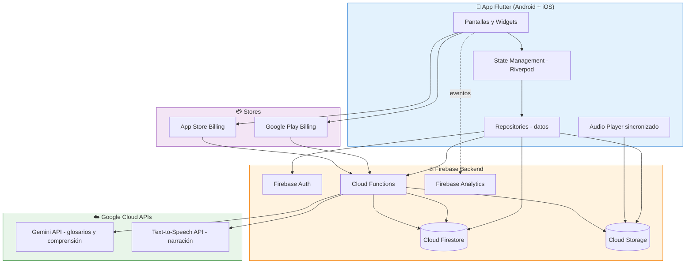
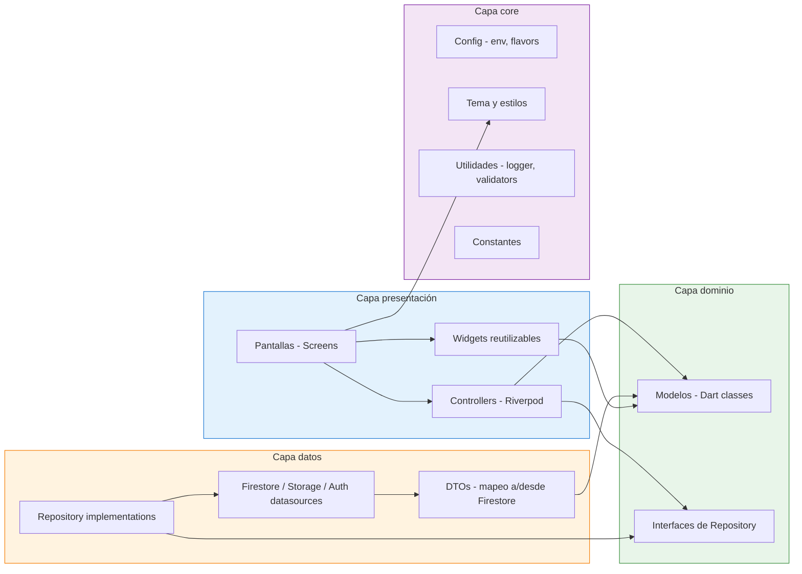
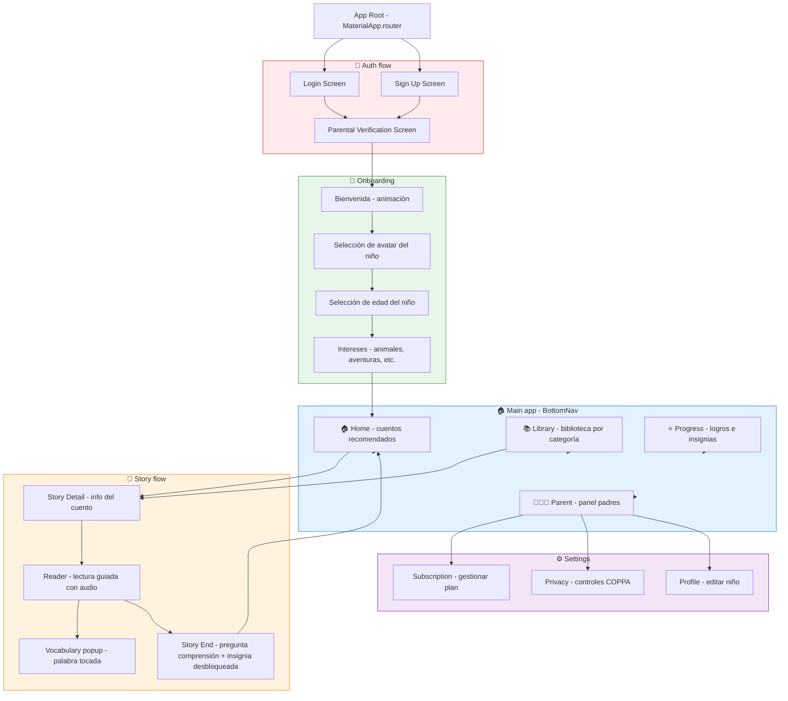
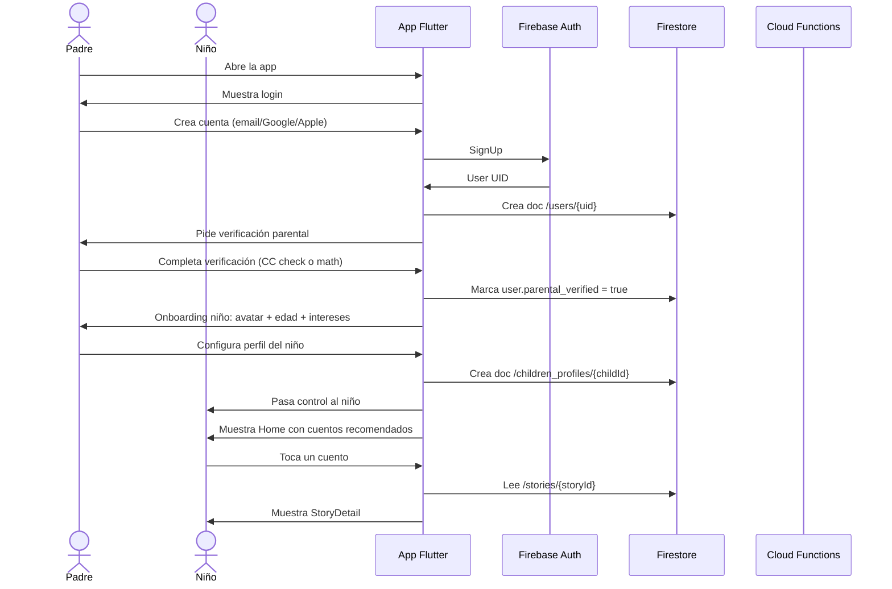
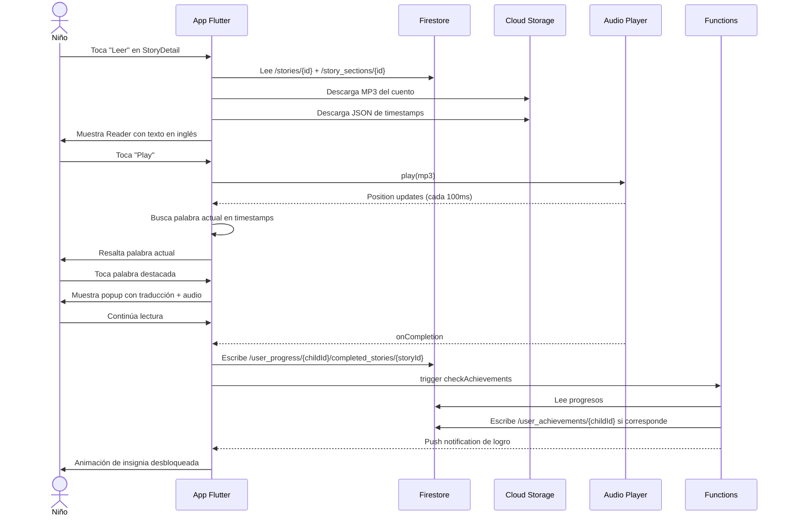
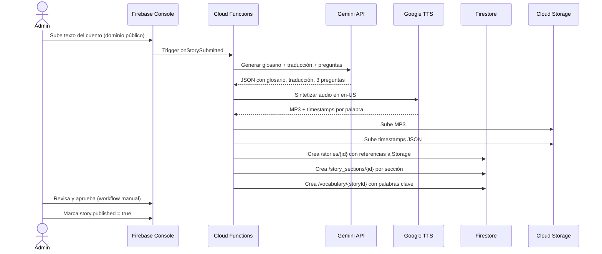

# 01 — Arquitectura técnica

> Cómo se estructuran los componentes de **StoryEnglish Kids**, qué hace cada uno y por qué elegimos cada tecnología.

---

## 1. Visión general

**StoryEnglish Kids** es una app móvil Flutter que se conecta a un backend 100% serverless en Firebase, complementado con dos APIs externas de Google: **Gemini** (IA generativa para glosarios y preguntas de comprensión) y **Text-to-Speech** (narración sincronizada).

No hay servidores que mantener. Firebase se encarga de Auth, base de datos, almacenamiento de archivos y funciones serverless. Los pagos se procesan nativamente en las tiendas (Google Play y App Store).

---

## 2. Justificación del stack

### Flutter (en lugar de React Native o nativo)

- **Un solo codebase** para Android y iOS. Reduce a la mitad el costo de desarrollo.
- **Performance cercano a nativo** porque compila a código nativo (no es una web view).
- **Hot reload** que acelera el desarrollo iterativo, clave cuando se prueba UX con niños.
- **Buen soporte para audio y animaciones**, que es crítico para una app de cuentos narrados.
- **Mismo equipo puede mantener ambas plataformas**, ideal si el equipo es chico.

**Trade-off**: si en algún momento necesitamos features muy específicas de plataforma (ej: integración profunda con Siri o Google Assistant), habría que escribir plugins nativos. No es el caso en el MVP.

### Firebase (en lugar de backend custom con Node + Postgres)

- **Auth listo**: email/password, Google, Apple, anónimo. Incluye manejo de sesiones, refresh tokens, reset password.
- **Firestore** es una base de datos NoSQL en tiempo real. Sirve perfectamente para documentos tipo `story`, `user_progress`, `achievements`.
- **Cloud Storage** para archivos binarios (imágenes, audio narrado en MP3).
- **Cloud Functions** para lógica que no debe correr en el cliente: llamadas a Gemini, llamadas a TTS, validación de receipts de billing, webhooks de stores.
- **Sin servidores que mantener**. Escala solo. Cobrás por uso.

**Trade-off**: Firestore NoSQL no es ideal para consultas relacionales complejas. Mitigamos con denormalización controlada (ver `04-firestore-schema.md`).

### Google Gemini API (en lugar de OpenAI u otras)

- **Pricing competitivo** para el volumen que esperamos (ver `07-costs.md`).
- **Multimodal**: puede procesar texto del cuento y generar glosarios, preguntas de comprensión, traducciones contextuales.
- **Integración nativa con Google Cloud**, mismo ecosistema que Firebase.
- **Buen soporte para few-shot prompting** en español + inglés.

**Uso concreto**:
- Al cargar un cuento nuevo al catálogo (proceso admin, no en runtime), una Cloud Function llama a Gemini para generar: glosario de palabras clave, preguntas de comprensión, traducción al español si el cuento no la tiene.
- Las respuestas se cachean en Firestore. **No se llama a Gemini en cada lectura del niño**, solo en la ingesta de contenido.

### Google Text-to-Speech (en lugar de Amazon Polly u otras)

- **Soporte para SSML** (Speech Synthesis Markup Language), que nos permite marcar dónde empieza cada palabra/frase y sincronizar el resaltado durante la reproducción.
- **Voces neurales de alta calidad** en inglés (en-US-Neural2-F, etc.) suenan naturales para narración infantil.
- **Pricing simple**: por carácter procesado. Ver `07-costs.md`.
- **Output MP3** que se guarda en Cloud Storage y se sirve cacheado.

**Proceso**:
- Cuando un cuento entra al catálogo, una Cloud Function genera el audio TTS completo y lo guarda en Storage.
- Para el resaltado palabra-a-palabra, generamos adicionalmente un archivo JSON con timestamps de cada palabra (`{word: "Once", start_ms: 0, end_ms: 320}`).
- El cliente reproduce el MP3 y usa los timestamps para resaltar la palabra actual en pantalla.

### Google Play Billing + App Store Billing (en lugar de Stripe)

- **Obligatorio** para suscripciones digitales dentro de apps móvil (políticas de Google y Apple). Apple cobra 30% (15% después del primer año de suscripción sostenida), Google 15-30%.
- **Stripe** solo se usaría si vendiéramos en web, que no está en el alcance actual.
- Las receipts se validan server-side en Cloud Functions para evitar fraudes.

---

## 3. Componentes del sistema

### 3.1 Capas de la app Flutter

La app usa **arquitectura limpia simplificada** en 4 capas:

**Por qué estas capas**:
- **Separación de responsabilidades**: si mañana cambiamos Firestore por otra base, solo tocamos la capa Data. La lógica de negocio (Domain) no cambia.
- **Testabilidad**: los Controllers dependen de interfaces (Repos), no de implementaciones. En tests les inyectamos mocks.
- **No over-engineering**: no usamos Use Cases separados de Controllers porque el dominio no es lo suficientemente complejo para justificarlo. Si crece, se separan.

### 3.2 State management: Riverpod

Elegimos **Riverpod** sobre Provider/Bloc/GetX porque:
- **Type-safe** (no hay `Provider.of<T>()` que se resuelve en runtime).
- **Testable** sin boilerplate (`ProviderContainer` en tests).
- **No depende de BuildContext**, lo que permite lógica fuera de widgets.
- **Manejo de estado async limpio** con `AsyncValue`.

### 3.3 Componentes Firebase

| Componente | Uso |
|------------|-----|
| **Firebase Auth** | Login con email/password, Google, Apple. Manejo de sesión. |
| **Cloud Firestore** | Base de datos de usuarios, perfiles de niños, cuentos, progreso, logros, suscripciones. |
| **Cloud Storage** | Imágenes de cuentos (portadas, ilustraciones por escena), audio MP3 narrado, JSON de timestamps. |
| **Cloud Functions** | Lógica server-side: ingesta de cuentos con Gemini+TTS, validación de receipts de billing, webhooks de stores, agregaciones analíticas, cleanup de datos de niños eliminados (COPPA). |
| **Firebase Analytics** | Eventos de uso agregados y anonimizados (sin PII de niños). |
| **Firebase Crashlytics** | Crash reporting automático. |
| **Firebase Remote Config** | Flags de features, A/B testing, precios dinámicos. |
| **Firebase App Check** | Protege endpoints contra abuso. |

---

## 4. Componentes Flutter (árbol de pantallas)

### Descripción de pantallas principales

| Pantalla | Función | Usuario |
|----------|---------|---------|
| **Login / SignUp** | Crear cuenta o iniciar sesión. Solo padre. | Padre |
| **Parental Verification** | Verifica que es un adulto (métodos: tarjeta de crédito guardada, matemática simple, o confirmación por email). Obligatorio por COPPA. | Padre |
| **Onboarding** | Configura el primer perfil del niño: avatar, edad, intereses. | Padre + niño |
| **Home** | Cuentos recomendados para el niño activo, basado en edad e intereses. Continuar leyendo. | Niño |
| **Library** | Catálogo navegable: por edad, por categoría temática, por duración. | Niño |
| **Reader** | Pantalla de lectura. Muestra el texto del cuento en inglés, traducción opcional, resalta palabra actual mientras suena el audio. Botón de pausa, replay, ajuste de velocidad. | Niño |
| **Vocabulary popup** | Al tocar una palabra destacada, muestra traducción al español + pronunciación + imagen. | Niño |
| **End screen** | Al terminar el cuento: pregunta de comprensión generada por Gemini, desbloqueo de insignia si corresponde, animación de logro. | Niño |
| **Progress** | Insignias ganadas, cuentos leídos, racha de días, palabras aprendidas. | Niño |
| **Parent** | Reportes de uso (tiempo, cuentos, progreso). Controles (límite de tiempo, bloqueo de cuentos por edad). Gestión de suscripción. | Padre |

---

## 5. Flujos de usuario principales

### 5.1 Onboarding y primer uso

### 5.2 Lectura de cuento con audio sincronizado

### 5.3 Ingesta de nuevo cuento (proceso admin, no runtime)

---

## 6. Flujos de datos y almacenamiento

### 6.1 Datos en Firestore (textos, metadatos, estado)

Firestore guarda **todo lo que es texto o estado**: perfiles de usuario, perfiles de niños, catálogo de cuentos, vocabulario, progreso, logros, suscripciones, configuración parental.

**No se guarda en Firestore**: contenido binario (audio MP3, imágenes). Esos van a Cloud Storage y Firestore guarda solo la URL/ruta.

### 6.2 Datos en Cloud Storage (binarios)

| Tipo de archivo | Ruta en Storage | Cuándo se genera |
|-----------------|-----------------|------------------|
| Portada de cuento | `stories/{storyId}/cover.jpg` | Ingesta admin |
| Ilustraciones por escena | `stories/{storyId}/scene_{n}.jpg` | Ingesta admin |
| Audio narrado en inglés | `stories/{storyId}/audio_en.mp3` | Ingesta admin (TTS) |
| Timestamps de palabras | `stories/{storyId}/timestamps_en.json` | Ingesta admin (TTS) |
| Audio narrado en español (opcional) | `stories/{storyId}/audio_es.mp3` | Ingesta admin |
| Avatares de niños | `users/{uid}/children/{childId}/avatar.png` | Upload del niño |
| Ilustraciones de logros | `achievements/{achievementId}/icon.png` | Asset estático |

### 6.3 Caching en el cliente

La app Flutter mantiene un cache local en `Hive` (base de datos local key-value) para:
- Catálogo de cuentos (metadata, no binarios)
- Progreso del niño (permite offline y sync cuando vuelve la conexión)
- Configuración parental
- Tokens de auth

Los binarios (audio MP3) se cachean en el dispositivo con `flutter_cache_manager`, con TTL de 7 días.

---

## 7. Escalabilidad

### 7.1 Firestore

Firestore escala automáticamente. Las consideraciones son de **costo** (ver `07-costs.md`), no de capacidad. La regla de oro es **minimizar reads**:
- Cache agresivo en cliente.
- Denormalización controlada (ej: en `user_progress` guardamos `story_title` además de `story_id`, para no tener que leer `/stories/{id}` solo para mostrar el título).
- Queries con índices compuestos bien diseñados (ver `04-firestore-schema.md`).

### 7.2 Cloud Functions

Functions escala automáticamente, pero tiene cold starts (~1-3s). Para funciones sensibles a latencia (como la validación de receipts de billing), usamos **min instances = 1** para mantener una caliente.

### 7.3 Storage

Cloud Storage sirve archivos vía CDN global. No hay que hacer nada especial para escalar.

### 7.4 Límites externos

- **Gemini API**: rate limits por proyecto. Para ingesta admin (no runtime), no es problema.
- **Google TTS API**: idem, se usa solo en ingesta.
- **Apple/Google billing**: sin límites relevantes.

---

## 8. Decisiones de arquitectura abiertas

| Decisión | Estado | Comentario |
|----------|--------|------------|
| ¿Generar audio TTS en runtime o en ingesta? | **Decidido: ingesta** | Runtime sería más flexible (voces personalizables por niño) pero más caro y con latencia. En ingesta cacheamos todo. |
| ¿Multi-idioma além de EN/ES? | **Pendiente** | Para MVP solo EN/ES. Arquitectura permite agregar más sin cambiar modelos. |
| ¿Modo offline completo? | **Pendiente** | MVP: offline para cuentos ya descargados. No para discover de nuevos cuentos. |
| ¿Web app complementaria? | **Futuro** | No en alcance actual. Si se hace, sería Flutter Web con Firebase. |
| ¿Soporte para tablets? | **Decidido: sí desde MVP** | Flutter lo da casi gratis. UX necesita ajustes pero no es trabajo extra significativo. |

---

## 9. Próximos pasos

1. Revisar y aprobar esta arquitectura.
2. Validar el modelo de datos en `03-data-models.md` y `04-firestore-schema.md`.
3. Confirmar el roadmap en `06-roadmap.md`.
4. Configurar el proyecto Firebase y el repo Flutter (Fase 0 del roadmap).
