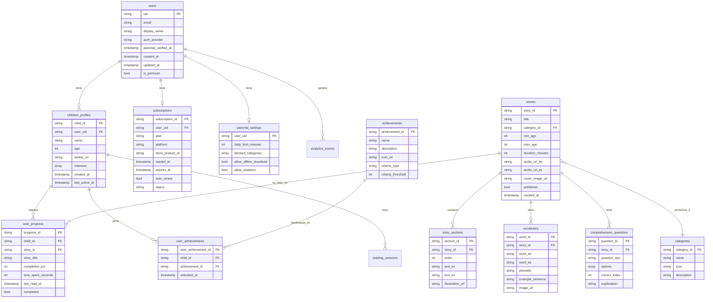

# 03 — Modelos de datos

> Definición de las clases Dart que representan las entidades del dominio. Cada modelo incluye campos, tipos, relaciones con otros modelos, y notas sobre indexación en Firestore.

---

## 1. Diagrama entidad-relación



---

## 2. Convenciones

- **Tipos Dart**: usamos `String`, `int`, `double`, `bool`, `DateTime`, `List<T>`, `Map<K,V>`.
- **Nullabilidad**: los campos opcionales se marcan con `?` (ej: `String? displayName`). Los obligatorios no llevan sufijo.
- **IDs**: generados con `UUID v4` desde el cliente para entidades creadas por el usuario. Para entidades creadas en ingesta admin, se usa un slug del título (`little-red-riding-hood`).
- **Timestamps**: `DateTime` en Dart, `Timestamp` en Firestore. Conversiones en la capa data.
- **Imágenes y audio**: se guarda la URL completa en Storage, no el binario.
- **Serialización**: usamos `freezed` + `json_serializable` para generar `fromJson`/`toJson` automáticamente.

---

## 3. Modelos detallados

### 3.1 `AppUser`

Representa al **padre/madre** que crea la cuenta. No al niño (los niños no tienen cuenta propia, viven como perfiles dentro de la cuenta del padre).

```dart
@freezed
class AppUser with _$AppUser {
  const factory AppUser({
    required String uid,                    // Firebase Auth UID
    required String email,
    String? displayName,
    required String authProvider,           // 'email' | 'google' | 'apple'
    DateTime? parentalVerifiedAt,           // null hasta que verifica ser adulto
    required bool isPremium,                // true si tiene suscripción activa
    DateTime? premiumExpiresAt,
    required DateTime createdAt,
    required DateTime updatedAt,
  }) = _AppUser;

  factory AppUser.fromJson(Map<String, dynamic> json) => _$AppUserFromJson(json);
}
```

**Colección Firestore**: `users` (document ID = `uid`)

**Validaciones**:
- `email` debe matchear regex de email.
- `parentalVerifiedAt` debe ser null o posterior a `createdAt`.
- `isPremium` y `premiumExpiresAt` se mantienen sincronizados con `subscriptions` vía Cloud Function.

---

### 3.2 `ChildProfile`

Perfil de un niño dentro de la cuenta del padre. Un padre puede tener hasta 4 perfiles (límite configurable).

```dart
@freezed
class ChildProfile with _$ChildProfile {
  const factory ChildProfile({
    required String childId,                // UUID v4 generado por cliente
    required String userUid,                // FK a AppUser.uid
    required String name,                   // Solo primer nombre, sin PII sensible
    required int age,                       // 2-7
    required String avatarUrl,              // URL en Storage o asset path
    List<String> interests,                 // ['animals', 'adventure', ...]
    required DateTime createdAt,
    DateTime? lastActiveAt,
    DateTime? deletedAt,                    // Soft delete para COPPA cleanup
  }) = _ChildProfile;

  factory ChildProfile.fromJson(Map<String, dynamic> json) => _$ChildProfileFromJson(json);
}
```

**Colección Firestore**: `children_profiles` (document ID = `childId`)

**Cumplimiento COPPA**: el nombre es **solo el primer nombre o apodo** elegido por el padre. Nunca apellido, nunca fecha de nacimiento exacta, nunca información de contacto del niño.

---

### 3.3 `Story`

Cuento del catálogo. Creado en proceso admin, no por usuarios.

```dart
@freezed
class Story with _$Story {
  const factory Story({
    required String storyId,                // Slug: 'little-red-riding-hood'
    required String title,                  // 'Little Red Riding Hood'
    required String categoryId,             // FK a categories
    required int minAge,                    // 2
    required int maxAge,                    // 4
    required int durationMinutes,           // 5 (estimado)
    required String audioUrlEn,             // Storage URL
    String? audioUrlEs,                     // Opcional, solo cuentos premium
    String? timestampsJsonUrl,              // Para resaltado palabra-a-palabra
    required String coverImageUrl,
    required String sourceAttribution,      // 'Brothers Grimm, public domain'
    required String sourceUrl,              // Link a Project Gutenberg o similar
    required bool published,                // false hasta aprobación admin
    required List<String> tags,             // ['classic', 'animals', 'adventure']
    required DateTime createdAt,
    DateTime? publishedAt,
  }) = _Story;

  factory Story.fromJson(Map<String, dynamic> json) => _$StoryFromJson(json);
}
```

**Colección Firestore**: `stories` (document ID = `storyId`)

**Subcolecciones** (en el mismo documento):
- `story_sections` (texto dividido por páginas/escenas)
- `vocabulary` (palabras clave destacadas)
- `comprehension_questions` (preguntas generadas por Gemini)

---

### 3.4 `StorySection`

Una página/escena del cuento. El cuento se divide en secciones para poder mostrar ilustración por escena y navegar página a página.

```dart
@freezed
class StorySection with _$StorySection {
  const factory StorySection({
    required String sectionId,
    required String storyId,                // FK
    required int order,                     // 1, 2, 3...
    required String textEn,                 // Texto en inglés
    required String textEs,                 // Traducción al español
    String? illustrationUrl,                // Imagen de la escena
    List<AudioTimestamp>? wordTimestamps,   // Para resaltado sincronizado
  }) = _StorySection;

  factory StorySection.fromJson(Map<String, dynamic> json) => _$StorySectionFromJson(json);
}
```

**Colección Firestore**: `stories/{storyId}/story_sections` (subcolección)

---

### 3.5 `AudioTimestamp`

No es una entidad persistida, sino parte del JSON descargado desde Storage. Se incluye aquí para entender la estructura.

```dart
@freezed
class AudioTimestamp with _$AudioTimestamp {
  const factory AudioTimestamp({
    required String word,
    required int startMs,                   // Milisegundos desde inicio del audio
    required int endMs,
  }) = _AudioTimestamp;
}
```

**Storage**: `stories/{storyId}/timestamps_en.json` (array de `AudioTimestamp`)

---

### 3.6 `VocabularyWord`

Palabra clave de un cuento, con traducción y pronunciación.

```dart
@freezed
class VocabularyWord with _$VocabularyWord {
  const factory VocabularyWord({
    required String wordId,
    required String storyId,                // FK
    required String wordEn,
    required String wordEs,
    String? phonetic,                       // '/wʊlf/' (IPA)
    String? exampleSentence,                // 'The wolf was hungry.'
    String? exampleTranslation,             // 'El lobo estaba hambriento.'
    String? imageUrl,                       // Imagen ilustrativa (opcional)
    required bool isHighlighted,            // Se resalta en el texto del cuento
  }) = _VocabularyWord;

  factory VocabularyWord.fromJson(Map<String, dynamic> json) => _$VocabularyWordFromJson(json);
}
```

**Colección Firestore**: `stories/{storyId}/vocabulary` (subcolección)

---

### 3.7 `ComprehensionQuestion`

Pregunta de comprensión lectora generada por Gemini al final del cuento.

```dart
@freezed
class ComprehensionQuestion with _$ComprehensionQuestion {
  const factory ComprehensionQuestion({
    required String questionId,
    required String storyId,                // FK
    required String questionText,           // 'Why did the wolf want to eat Little Red?'
    required List<String> options,          // 4 opciones
    required int correctIndex,              // 0-3
    required String explanation,            // Se muestra si se equivoca
  }) = _ComprehensionQuestion;

  factory ComprehensionQuestion.fromJson(Map<String, dynamic> json) => _$ComprehensionQuestionFromJson(json);
}
```

**Colección Firestore**: `stories/{storyId}/comprehension_questions` (subcolección)

---

### 3.8 `UserProgress`

Progreso de un niño en un cuento específico. Se actualiza en tiempo real durante la lectura.

```dart
@freezed
class UserProgress with _$UserProgress {
  const factory UserProgress({
    required String progressId,             // '{childId}_{storyId}'
    required String childId,                // FK
    required String storyId,                // FK
    required String storyTitle,             // Denormalizado para no leer /stories
    required int completionPct,             // 0-100
    required int timeSpentSeconds,
    required int lastSectionOrder,          // Para reanudar donde quedó
    required bool completed,
    DateTime? completedAt,
    required DateTime lastReadAt,
    required DateTime createdAt,
  }) = _UserProgress;

  factory UserProgress.fromJson(Map<String, dynamic> json) => _$UserProgressFromJson(json);
}
```

**Colección Firestore**: `user_progress` (document ID = `{childId}_{storyId}`)

**Índices compuestos necesarios**:
- `childId` ASC + `lastReadAt` DESC (para "continuar leyendo")
- `childId` ASC + `completed` ASC + `completedAt` DESC (para "cuentos leídos")

---

### 3.9 `ReadingSession`

Sesión individual de lectura. Permite analítica granular (cuánto tiempo leyó cada día, abandonos, etc.).

```dart
@freezed
class ReadingSession with _$ReadingSession {
  const factory ReadingSession({
    required String sessionId,              // UUID
    required String childId,                // FK
    required String storyId,                // FK
    required DateTime startedAt,
    DateTime? endedAt,
    required int durationSeconds,
    required int sectionsRead,
    required bool completed,
  }) = _ReadingSession;

  factory ReadingSession.fromJson(Map<String, dynamic> json) => _$ReadingSessionFromJson(json);
}
```

**Colección Firestore**: `reading_sessions` (document ID = `sessionId`)

**Índices**:
- `childId` ASC + `startedAt` DESC
- `startedAt` ASC (para agregaciones diarias/semanales)

**Optimización**: esta colección puede crecer mucho. Ver `07-costs.md` para estrategia de archival (mover a BigQuery después de 90 días).

---

### 3.10 `Achievement` y `UserAchievement`

Logros/insignias que el niño puede desbloquear.

```dart
@freezed
class Achievement with _$Achievement {
  const factory Achievement({
    required String achievementId,          // 'first_story' | 'streak_7_days' | ...
    required String name,                   // 'First Steps'
    required String description,            // 'Read your first story'
    required String iconUrl,                // Asset o Storage
    required String criteriaType,           // 'stories_completed' | 'streak_days' | ...
    required int criteriaThreshold,         // 1, 7, 30, etc.
    required bool isHidden,                 // Sorpresa hasta desbloquear
  }) = _Achievement;

  factory Achievement.fromJson(Map<String, dynamic> json) => _$AchievementFromJson(json);
}

@freezed
class UserAchievement with _$UserAchievement {
  const factory UserAchievement({
    required String userAchievementId,      // '{childId}_{achievementId}'
    required String childId,                // FK
    required String achievementId,          // FK
    required DateTime unlockedAt,
  }) = _UserAchievement;

  factory UserAchievement.fromJson(Map<String, dynamic> json) => _$UserAchievementFromJson(json);
}
```

**Colecciones Firestore**:
- `achievements` (catálogo global, lectura pública)
- `user_achievements` (por niño)

---

### 3.11 `Subscription`

Estado de la suscripción premium del usuario.

```dart
@freezed
class Subscription with _$Subscription {
  const factory Subscription({
    required String subscriptionId,         // '{userUid}_{platform}'
    required String userUid,                // FK
    required String plan,                   // 'monthly' | 'annual'
    required String platform,               // 'android' | 'ios'
    required String storeProductId,         // SKU en la store
    required DateTime startedAt,
    required DateTime expiresAt,
    required bool autoRenew,
    required String status,                 // 'active' | 'expired' | 'canceled' | 'grace_period'
    String? lastReceiptId,
    DateTime? canceledAt,
  }) = _Subscription;

  factory Subscription.fromJson(Map<String, dynamic> json) => _$SubscriptionFromJson(json);
}
```

**Colección Firestore**: `subscriptions` (document ID = `subscriptionId`)

**Validación server-side**: la Cloud Function `billing_validation` actualiza este documento cuando recibe webhooks de Google Play Real-time Developer Notifications o notificaciones de App Store Server Notifications.

---

### 3.12 `ParentalSettings`

Configuración parental del usuario.

```dart
@freezed
class ParentalSettings with _$ParentalSettings {
  const factory ParentalSettings({
    required String userUid,                // PK = FK
    required int dailyLimitMinutes,         // 0 = sin límite
    List<String> blockedCategories,
    required bool allowOfflineDownload,
    required bool allowAnalytics,           // COPPA: opt-in explícito
    required bool allowPersonalizedAds,     // Siempre false para COPPA
    TimeOfDay? bedtimeStart,                // Bloquea uso en horario noche
    TimeOfDay? bedtimeEnd,
  }) = _ParentalSettings;

  factory ParentalSettings.fromJson(Map<String, dynamic> json) => _$ParentalSettingsFromJson(json);
}
```

**Colección Firestore**: `parental_settings` (document ID = `userUid`)

---

### 3.13 `Category`

Categorías temáticas para organizar la biblioteca.

```dart
@freezed
class Category with _$Category {
  const factory Category({
    required String categoryId,             // 'animals' | 'adventure' | 'bedtime' | ...
    required String name,                   // Display name (localizado)
    required String iconAsset,              // 'assets/icons/animals.svg'
    String? description,
  }) = _Category;

  factory Category.fromJson(Map<String, dynamic> json) => _$CategoryFromJson(json);
}
```

**Colección Firestore**: `categories` (catálogo global, lectura pública)

---

### 3.14 `AnalyticsEvent`

Eventos analíticos anonimizados. **Sin PII del niño.**

```dart
@freezed
class AnalyticsEvent with _$AnalyticsEvent {
  const factory AnalyticsEvent({
    required String eventId,                // UUID
    required String userUid,                // FK al padre, no al niño
    String? childIdHash,                    // Hash, no el childId real
    required String eventName,              // 'story_started' | 'story_completed' | ...
    required Map<String, dynamic> params,
    required DateTime occurredAt,
  }) = _AnalyticsEvent;

  factory AnalyticsEvent.fromJson(Map<String, dynamic> json) => _$AnalyticsEventFromJson(json);
}
```

**Colección Firestore**: `analytics_events` (con TTL de 90 días configurado en Firestore TTL policy)

**Alternativa**: para alto volumen, usar directamente Firebase Analytics + BigQuery export en lugar de Firestore. Decisión diferida a Fase 4 del roadmap.

---

## 4. Relaciones y referencias

### 4.1 Referencias débiles (denormalización)

En `user_progress` guardamos `storyTitle` además de `storyId`. Esto evita un read adicional a `/stories/{storyId}` cuando mostramos la lista de "cuentos leídos". Costo: si se cambia el título de un cuento, hay que actualizar los `user_progress` correspondientes (raro en la práctica).

### 4.2 Subcolecciones vs colecciones raíz

**Subcolecciones** (cuando el documento padre siempre se lee junto con sus hijos):
- `stories/{storyId}/story_sections`
- `stories/{storyId}/vocabulary`
- `stories/{storyId}/comprehension_questions`

**Colecciones raíz** (cuando necesitamos querys independientes del padre):
- `user_progress` (queremos poder listar "todo el progreso de un niño")
- `user_achievements` (queremos poder listar "todos los logros de un niño")
- `reading_sessions` (queremos poder agregar por día/semana)

### 4.3 Soft deletes

Para cumplir con COPPA/GDPR-K (ver `05-security-and-privacy.md`), los `children_profiles` se marcan con `deletedAt` en lugar de borrarse físicamente. Una Cloud Function (`coppa_cleanup`) los elimina definitivamente después de 30 días de gracia (por si el padre se arrepiente).

---

## 5. Próximos pasos

1. Validar estos modelos con el equipo.
2. Generar el código Dart con `build_runner` (freezed + json_serializable).
3. Implementar la capa de datos (DTOs + repositories).
4. Configurar Firestore con los índices compuestos necesarios (ver `04-firestore-schema.md`).
