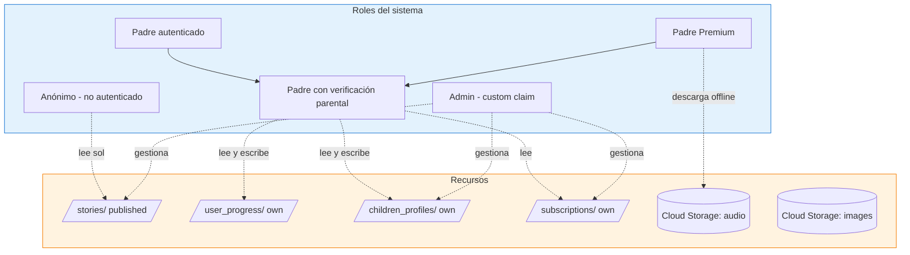
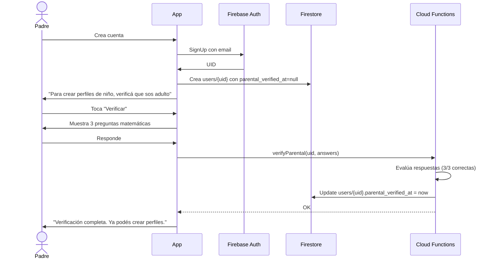

# 05 — Seguridad y privacidad

> Reglas de seguridad de Firestore y Storage, modelo de roles (RBAC), y cumplimiento de COPPA y GDPR-K.

---

## 1. Modelo de roles



### Descripción de roles

| Rol | Cómo se obtiene | Permisos |
|-----|-----------------|----------|
| **Anónimo** | Default, sin login | Leer cuentos publicados (metadata, no audio premium). Crear cuenta. |
| **Padre autenticado** | Login con email/Google/Apple | Todo lo de anónimo + crear perfil de niño (pero bloqueado hasta verificación parental). |
| **Padre verificado** | Completa verificación parental | Todo lo anterior + crear/editar perfiles de niños, registrar progreso, configurar controles parentales. |
| **Padre Premium** | Suscripción activa | Todo lo anterior + acceso a audio premium, descargas offline, perfiles múltiples ilimitados. |
| **Admin** | Custom claim seteada vía Cloud Function | CRUD sobre `stories`, `categories`, `achievements`. Acceso a métricas agregadas. |

---

## 2. Verificación parental

Para cumplir con COPPA, antes de crear cualquier perfil de niño, el padre debe completar verificación. Métodos aceptados (al menos uno):

1. **Tarjeta de crédito guardada**: una Cloud Function hace un cargo de $0.01 que se revierte inmediatamente. No se guarda el número, solo confirmación del issuer.
2. **Math challenge**: 3 preguntas matemáticas tipo "5 + 7 = ?". Débil pero aceptado por FTC como señal de adulto.
3. **Email confirmado + 24h de espera**: el padre confirma email y debe esperar 24h antes de crear perfil de niño. Útil para registro low-friction pero con fricción en el primer uso.

**Para MVP**: método 2 (math challenge) + email confirmado. El método 1 (CC) se agrega en Fase 4.

### Flujo de verificación



---

## 3. Reglas de Firestore (`firestore.rules`)

```javascript
rules_version = '2';
service cloud.firestore {
  match /databases/{database}/documents {

    // ============== HELPERS ==============
    function isSignedIn() {
      return request.auth != null;
    }

    function isOwner(uid) {
      return isSignedIn() && request.auth.uid == uid;
    }

    function isParentalVerified() {
      return isSignedIn()
        && exists(/databases/$(database)/documents/users/$(request.auth.uid))
        && get(/databases/$(database)/documents/users/$(request.auth.uid)).data.parental_verified_at != null;
    }

    function isPremium() {
      return isSignedIn()
        && get(/databases/$(database)/documents/users/$(request.auth.uid)).data.is_premium == true;
    }

    function isAdmin() {
      return isSignedIn() && request.auth.token.admin == true;
    }

    function isOwnerOfChild(childId) {
      return isSignedIn()
        && exists(/databases/$(database)/documents/children_profiles/$(childId))
        && get(/databases/$(database)/documents/children_profiles/$(childId)).data.user_uid == request.auth.uid;
    }

    // ============== USERS ==============
    match /users/{uid} {
      allow read: if isOwner(uid) || isAdmin();
      allow create: if isOwner(uid);
      allow update: if isOwner(uid)
                    && !('is_premium' in request.resource.data.diff(resource.data).affectedKeys())
                    && !('parental_verified_at' in request.resource.data.diff(resource.data).affectedKeys())
                    || isAdmin();
      // is_premium y parental_verified_at solo los setea server-side
      allow delete: if isAdmin();
    }

    // ============== CHILDREN PROFILES ==============
    match /children_profiles/{childId} {
      allow read: if isOwnerOfChild(childId) || isAdmin();
      allow create: if isParentalVerified()
                    && request.resource.data.user_uid == request.auth.uid
                    && countParentalChildren() < 4;
      allow update: if isOwnerOfChild(childId);
      // Delete lógico: solo setea deleted_at. Físico: solo Cloud Function.
      allow delete: if false;
    }

    function countParentalChildren() {
      return get(/databases/$(database)/documents/users/$(request.auth.uid)).data.children_count;
      // Mantenido actualizado por Cloud Function trigger
    }

    // ============== PARENTAL SETTINGS ==============
    match /parental_settings/{uid} {
      allow read: if isOwner(uid);
      allow write: if isOwner(uid);
    }

    // ============== SUBSCRIPTIONS ==============
    match /subscriptions/{subId} {
      allow read: if isSignedIn()
                  && resource.data.user_uid == request.auth.uid;
      allow write: if false;  // Solo Cloud Functions
    }

    // ============== STORIES (catálogo) ==============
    match /stories/{storyId} {
      allow read: if resource.data.published == true || isAdmin();
      allow write: if isAdmin();

      match /story_sections/{sectionId} {
        allow read: if get(/databases/$(database)/documents/stories/$(storyId)).data.published == true || isAdmin();
        allow write: if isAdmin();
      }

      match /vocabulary/{wordId} {
        allow read: if get(/databases/$(database)/documents/stories/$(storyId)).data.published == true || isAdmin();
        allow write: if isAdmin();
      }

      match /comprehension_questions/{qId} {
        allow read: if get(/databases/$(database)/documents/stories/$(storyId)).data.published == true || isAdmin();
        allow write: if isAdmin();
      }
    }

    // ============== CATEGORIES, ACHIEVEMENTS ==============
    match /categories/{categoryId} {
      allow read: if true;
      allow write: if isAdmin();
    }

    match /achievements/{achievementId} {
      allow read: if true;
      allow write: if isAdmin();
    }

    // ============== USER PROGRESS ==============
    match /user_progress/{progressId} {
      allow read: if isSignedIn()
                  && isOwnerOfChild(resource.data.child_id);
      allow create: if isSignedIn()
                    && isOwnerOfChild(request.resource.data.child_id);
      allow update: if isSignedIn()
                    && isOwnerOfChild(resource.data.child_id);
      allow delete: if false;
    }

    // ============== USER ACHIEVEMENTS ==============
    match /user_achievements/{uaId} {
      allow read: if isSignedIn()
                  && isOwnerOfChild(resource.data.child_id);
      allow write: if false;  // Solo Cloud Functions (achievement_engine)
    }

    // ============== READING SESSIONS ==============
    match /reading_sessions/{sessionId} {
      allow read: if isSignedIn()
                  && isOwnerOfChild(resource.data.child_id);
      allow create: if isSignedIn()
                    && isOwnerOfChild(request.resource.data.child_id);
      allow update, delete: if false;  // Inmutable una vez creado
    }

    // ============== ANALYTICS EVENTS ==============
    match /analytics_events/{eventId} {
      allow read: if isAdmin();
      allow create: if isSignedIn()
                    && request.resource.data.user_uid == request.auth.uid;
      allow update, delete: if false;
    }
  }
}
```

---

## 4. Reglas de Cloud Storage (`storage.rules`)

```javascript
rules_version = '2';
service firebase.storage {
  match /b/{bucket}/o {

    function isSignedIn() { return request.auth != null; }
    function isPremium() {
      return isSignedIn()
        && firestore.get(/databases/(default)/documents/users/$(request.auth.uid)).data.is_premium == true;
    }
    function isAdmin() {
      return isSignedIn() && request.auth.token.admin == true;
    }

    // Portadas e ilustraciones de cuentos: público (covered by App Check)
    match /stories/{storyId}/cover.jpg {
      allow read: if true;
      allow write: if isAdmin();
    }
    match /stories/{storyId}/scene_{n}.jpg {
      allow read: if true;
      allow write: if isAdmin();
    }

    // Audio en inglés: gratis
    match /stories/{storyId}/audio_en.mp3 {
      allow read: if isSignedIn();
      allow write: if isAdmin();
    }

    // Audio en español: premium
    match /stories/{storyId}/audio_es.mp3 {
      allow read: if isPremium();
      allow write: if isAdmin();
    }

    // Timestamps: gratis (necesario para lectura guiada)
    match /stories/{storyId}/timestamps_en.json {
      allow read: if isSignedIn();
      allow write: if isAdmin();
    }

    // Avatares de niños: solo el padre dueño
    match /users/{uid}/children/{childId}/avatar.png {
      allow read: if isSignedIn() && request.auth.uid == uid;
      allow write: if isSignedIn() && request.auth.uid == uid;
    }

    // Iconos de logros: público
    match /achievements/{achievementId}/icon.png {
      allow read: if true;
      allow write: if isAdmin();
    }
  }
}
```

---

## 5. COPPA (Children's Online Privacy Protection Act)

COPPA aplica a servicios online dirigidos a niños menores de 13 años en EE.UU. StoryEnglish Kids está dirigido a 2-7 años, así que **COPPA aplica plenamente**.

### 5.1 Requisitos clave y cómo los cumplimos

| Requisito COPPA | Cómo lo cumplimos |
|-----------------|-------------------|
| **Notificación clara a padres** sobre qué datos se recogen | Pantalla de privacidad obligatoria en onboarding, antes de crear cuenta. Texto en español + inglés. |
| **Consentimiento parental verificable** antes de recoger datos del niño | Flujo de verificación parental (sección 2 de este doc). Sin verificación, no se puede crear perfil de niño. |
| **Derecho del padre a revisar los datos del niño** | Panel para padres → "Datos de mi hijo" → muestra todo lo recolectado, con opción de exportar. |
| **Derecho del padre a borrar los datos del niño** | Panel para padres → "Eliminar perfil" → soft delete + borrado físico tras 30 días. Cloud Function `coppa_cleanup`. |
| **Derecho a negar consentimiento y retirarlo** | Padre puede desactivar analytics en `parental_settings.allow_analytics = false`. Retirar consentimiento = borrar perfil del niño. |
| **No recoger más datos de los necesarios** | Solo: primer nombre/apodo, edad, avatar, intereses. Sin apellido, sin fecha nacimiento, sin email, sin ubicación, sin contacto. |
| **Seguridad razonable de los datos** | Firestore encriptado at-rest, TLS in-transit, App Check, reglas estrictas. |
| **No retener datos más de lo necesario** | `analytics_events` TTL 90 días. `reading_sessions` 90 días → archive. Perfiles de niños: soft delete + 30 días. |
| **No compartir con terceros sin consentimiento** | No compartimos PII con terceros. Gemini recibe texto del cuento (sin datos del niño). TTS recibe texto del cuento. |
| **No usar datos para publicidad personalizada** | `parental_settings.allow_personalized_ads = false` siempre (inmutable). Solo ads contextuales si los hubiera (no en MVP). |

### 5.2 Datos personales que SÍ recogemos (del niño)

- Primer nombre o apodo (elegido por el padre)
- Edad (rango 2-7)
- Avatar (imagen elegida, no foto)
- Intereses temáticos (animales, aventuras, etc.)
- Progreso de lectura (qué cuentos leyó, cuánto tiempo)
- Logros desbloqueados

### 5.3 Datos que NO recogemos (del niño)

- Apellido
- Fecha de nacimiento exacta
- Email
- Teléfono
- Ubicación GPS
- Foto real
- Información de contacto
- Datos del dispositivo (más allá de lo necesario para operar)
- Información de navegación fuera de la app

---

## 6. GDPR-K (General Data Protection Regulation - Kids)

GDPR aplica a usuarios en la UE. Para menores, el "age of digital consent" varía entre 13-16 años según el país miembro. Para niños de 2-7, **el consentimiento lo debe dar el padre** bajo GDPR Art. 8.

### 6.1 Requisitos adicionales sobre COPPA

| Requisito GDPR | Cómo lo cumplimos |
|----------------|-------------------|
| **Base legal para procesamiento** | Consentimiento del padre (Art. 6(1)(a) + Art. 8). |
| **Derecho al acceso (Art. 15)** | Panel para padres → Exportar datos → JSON con todo. |
| **Derecho al borrado (Art. 17)** | Panel para padres → Eliminar perfil + cuenta completa. Cloud Function borra todo en 30 días. |
| **Derecho a la portabilidad (Art. 20)** | Exportación en formato JSON estándar. |
| **Derecho a objeción (Art. 21)** | Padre puede desactivar analytics en cualquier momento. |
| **Derecho a rectificación (Art. 16)** | Padre puede editar nombre, edad, avatar del niño. |
| **Notificación de brecha en 72h (Art. 33)** | Procedimiento de incidente documentado internamente. |
| **DPIA (Art. 35)** | DPIA (Data Protection Impact Assessment) a completar antes del launch. |

### 6.2 Banner de cookies/consentimiento

La app no usa cookies web pero sí Firebase Analytics. Mostramos **consentimiento granular** al primer uso:

- ☑ Necesario para funcionamiento (no se puede desactivar)
- ☐ Analytics (opt-in, default off)
- ☐ Personalización (opt-in, default off)

---

## 7. App Check

Habilitamos **Firebase App Check** con los siguientes proveedores:

- **Android**: Play Integrity API (verifica que la app está firmada y no modificada).
- **iOS**: DeviceCheck + App Attest.

App Check protege:
- Cloud Firestore (lectura/escritura)
- Cloud Storage
- Cloud Functions (vía enforcement)

Sin App Check token válido, los requests se rechazan. Esto previene abuso desde clientes no autorizados (scraping, automatización maliciosa).

---

## 8. Rate limiting

Cloud Functions expuestas al cliente tienen rate limiting por UID:

| Función | Límite |
|---------|--------|
| `verifyParental` | 3 intentos / hora |
| `validatePlayReceipt` / `validateAppStoreReceipt` | 10 / día |
| `generateAudio` (si se hace runtime, no MVP) | 0 (solo ingesta) |
| `recordAnalyticsEvent` | 100 / minuto |
| `updateProgress` | 6 / minuto (cada 10s) |

Implementado con Firestore counters (`rate_limit/{uid}_{action}`).

---

## 9. Audit log

Para fines de compliance, mantenemos un log de acciones sensibles en `audit_log` (colección separada, solo admin):

```typescript
{
  event_id: string,
  actor_uid: string,
  action: 'parental_verified' | 'child_created' | 'child_deleted' | 'subscription_started' | 'data_exported' | ...,
  target_id: string | null,
  occurred_at: Timestamp,
  ip_hash: string,                // Hash, no IP real
  metadata: Map<string, any>,
}
```

TTL: 2 años (requisito típico de compliance).

---

## 10. Checklist pre-launch

Antes de publicar en stores:

- [ ] DPIA (Data Protection Impact Assessment) completado
- [ ] Política de privacidad redactada y publicada (URL accesible desde stores)
- [ ] Términos de servicio redactados
- [ ] Reglas de Firestore testeadas con Firebase Emulator
- [ ] Reglas de Storage testeadas
- [ ] Cloud Function `coppa_cleanup` testeada con datos reales
- [ ] Flujo de exportación de datos del niño testeado end-to-end
- [ ] Flujo de eliminación de cuenta testeado end-to-end
- [ ] Banner de consentimiento granular implementado
- [ ] App Check habilitado y enforced en producción
- [ ] Audit log funcional y verificado
- [ ] Contacto de DPO (Data Protection Officer) publicado en política de privacidad
- [ ] Registro de actividades de procesamiento (ROPA) actualizado

---

## 11. Recursos externos

- [FTC COPPA guidance](https://www.ftc.gov/business-guidance/privacy-security/childrens-privacy)
- [GDPR official text](https://gdpr-info.eu/)
- [Firebase Security Rules best practices](https://firebase.google.com/docs/rules)
- [App Check documentation](https://firebase.google.com/docs/app-check)
