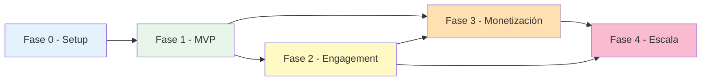

# 06 — Roadmap de desarrollo

> Plan de desarrollo de **StoryEnglish Kids** en 5 fases. Cada fase se desglosa en sprints de 2 semanas con user stories y tareas técnicas accionables.

---

## 1. Visión general

| Fase | Nombre | Duración | Objetivo | Output |
|------|--------|----------|----------|--------|
| 0 | **Setup** | 2 semanas (1 sprint) | Infraestructura lista para empezar a codear | Repo, Firebase projects, CI/CD, environment |
| 1 | **MVP** | 10 semanas (5 sprints) | App funcional con cuentos + lectura guiada + auth | Beta privada con 20 familias |
| 2 | **Engagement** | 8 semanas (4 sprints) | Logros, progreso, panel padres | Beta pública con 200 familias |
| 3 | **Monetización** | 6 semanas (3 sprints) | Suscripciones, paywall, billing | App publicada en stores |
| 4 | **Escala** | 8 semanas (4 sprints) | Optimización, monitoring, content scaling | 10K+ usuarios |

**Duración total estimada**: 34 semanas (~8 meses) con 1 desarrollador full-time + 1 diseñador/a media jornada. Con 2 devs full-time se puede comprimir a ~5-6 meses paralelizando Fases 1 y 2.

---

## 2. Fase 0 — Setup (2 semanas)

**Objetivo**: tener todo listo para que el Sprint 1 empiece a codear features.

### Sprint 0.1 — Setup técnico

**Tareas**:

| ID | Tarea | Responsable | Esfuerzo |
|----|-------|-------------|----------|
| T0.1.1 | Crear proyecto Flutter `storyenglish_kids` con `flutter create` | Dev | 0.5 día |
| T0.1.2 | Configurar flavors dev/prod (`main_dev.dart`, `main_prod.dart`) | Dev | 1 día |
| T0.1.3 | Crear 2 proyectos en Firebase Console: `storyenglish-dev` y `storyenglish-prod` | Dev | 0.5 día |
| T0.1.4 | Habilitar en ambos: Auth (email/Google/Apple), Firestore, Storage, Functions, Analytics, Crashlytics, App Check | Dev | 0.5 día |
| T0.1.5 | Descargar `google-services.json` (Android) y `GoogleService-Info.plist` (iOS) para cada flavor y commitearlos (dev) o agregar a CI secrets (prod) | Dev | 0.5 día |
| T0.1.6 | Configurar Firebase Emulator Suite local (Auth, Firestore, Storage, Functions) con script `firebase emulators:start` | Dev | 1 día |
| T0.1.7 | Configurar `dart_code_metrics` con reglas de arquitectura (import_lint) | Dev | 0.5 día |
| T0.1.8 | Crear GitHub Actions workflow `ci.yml`: analyze + test en cada PR | Dev | 1 día |
| T0.1.9 | Crear GitHub Actions workflows `cd_dev.yml` y `cd_prod.yml` para deploy de Cloud Functions | Dev | 1 día |
| T0.1.10 | Estructurar carpetas del proyecto según `02-folder-structure.md` (vacías con `.gitkeep`) | Dev | 0.5 día |
| T0.1.11 | Configurar `pubspec.yaml` con dependencias base (ver doc estructura) | Dev | 0.5 día |
| T0.1.12 | Configurar `l10n` con archivos `app_en.arb` y `app_es.arb` vacíos | Dev | 0.5 día |
| T0.1.13 | Setup de Crashlytics en ambos flavors | Dev | 0.5 día |
| T0.1.14 | Documentar setup local en `docs/SETUP.md` (cómo correr la app, emulador, tests) | Dev | 1 día |
| T0.1.15 | Crear apps en Google Play Console y App Store Connect (placeholders, sin upload todavía) | Dev/PM | 1 día |

**Entregables**:
- App Flutter corre en emulador Android y simulador iOS con ambos flavors.
- `flutter analyze` pasa sin warnings.
- CI verde en PR de prueba.
- Firebase Emulator Suite funciona.
- Documentación de setup completa.

**Criterios de aceptación**:
- Un dev nuevo puede seguir `SETUP.md` y tener la app corriendo en <1h.
- Push a `main` deploya Cloud Functions a Firebase dev automáticamente.

---

## 3. Fase 1 — MVP (10 semanas)

**Objetivo**: app funcional que permita a 20 familias probar el flujo completo de registro → onboarding → leer cuento → ver progreso básico.

### Sprint 1.1 — Auth + Parental Verification

**User stories**:
- Como padre, quiero crear cuenta con email/password para empezar a usar la app.
- Como padre, quiero iniciar sesión con Google para no tener que recordar otra password.
- Como padre, quiero iniciar sesión con Apple (requerido por App Store si ofreces Google).
- Como padre, quiero verificar que soy adulto para poder crear perfiles de mi hijo.
- Como padre, quiero cerrar sesión.

**Tareas**:

| ID | Tarea | Esfuerzo |
|----|-------|----------|
| T1.1.1 | Implementar `AppUser` model con freezed | 0.5 día |
| T1.1.2 | Implementar `AuthRepository` (abstract) y `AuthRepositoryImpl` con `FirebaseAuthDatasource` | 2 días |
| T1.1.3 | Implementar `AuthController` con Riverpod | 1 día |
| T1.1.4 | Pantalla `LoginScreen` con email/password + Google + Apple | 2 días |
| T1.1.5 | Pantalla `SignUpScreen` con validaciones | 1 día |
| T1.1.6 | Cloud Function `verifyParental` (math challenge) | 1 día |
| T1.1.7 | Pantalla `ParentalVerificationScreen` | 1 día |
| T1.1.8 | Cloud Function trigger `onUserCreate` que crea doc en `users/{uid}` | 0.5 día |
| T1.1.9 | Implementar reglas Firestore para `users` | 0.5 día |
| T1.1.10 | Configurar Auth providers en Firebase Console (Google, Apple) | 0.5 día |
| T1.1.11 | Tests unitarios de `AuthController` con mocks | 1 día |
| T1.1.12 | Tests de widget de pantallas de auth | 1 día |
| T1.1.13 | Configurar `go_router` con redirect a login si no autenticado | 0.5 día |

**Entregables**:
- Flujo completo de signup/login/verificación parental funcional en dev.
- Tests de auth pasando en CI.

---

### Sprint 1.2 — Onboarding + Child Profile

**User stories**:
- Como padre verificado, quiero configurar el primer perfil de mi hijo (avatar, nombre, edad, intereses).
- Como padre, quiero poder editar el perfil después.
- Como niño, quiero ver una pantalla de bienvenida divertida al entrar por primera vez.

**Tareas**:

| ID | Tarea | Esfuerzo |
|----|-------|----------|
| T1.2.1 | Implementar `ChildProfile` model con freezed | 0.5 día |
| T1.2.2 | Implementar `ChildProfileRepository` + impl | 1 día |
| T1.2.3 | Implementar `ChildProfileController` | 1 día |
| T1.2.4 | Pantalla `WelcomeScreen` con animación Lottie | 1 día |
| T1.2.5 | Pantalla `PickAvatarScreen` con grid de avatares predefinidos | 1 día |
| T1.2.6 | Pantalla `PickAgeScreen` con selector visual | 0.5 día |
| T1.2.7 | Pantalla `PickInterestsScreen` con chips multiselect | 0.5 día |
| T1.2.8 | Cloud Function `onChildCreate` que valida límite de 4 perfiles + actualiza `users.children_count` | 1 día |
| T1.2.9 | Subida de avatar a Storage (si custom) o selección de asset predefinido | 1 día |
| T1.2.10 | Pantalla `EditChildScreen` para edición posterior | 1 día |
| T1.2.11 | Pantalla `ChildPickerScreen` para switch entre perfiles | 1 día |
| T1.2.12 | Implementar `parental_settings` model + repo + pantalla de edición básica | 1.5 días |
| T1.2.13 | Tests unitarios + widget | 1.5 días |

**Entregables**:
- Onboarding completo de primer uso.
- Múltiples perfiles de niños funcionando.

---

### Sprint 1.3 — Story ingestion (admin) + data seeding

**User stories**:
- Como admin, quiero cargar cuentos de dominio público al catálogo.
- Como admin, quiero que Gemini genere automáticamente glosario, traducción y preguntas de comprensión.
- Como admin, quiero que TTS genere el audio narrado en inglés.

**Tareas**:

| ID | Tarea | Esfuerzo |
|----|-------|----------|
| T1.3.1 | Crear colección `categories` con 8-10 categorías iniciales | 0.5 día |
| T1.3.2 | Crear colección `achievements` con 10 logros iniciales | 0.5 día |
| T1.3.3 | Script `seed_stories.ts` para cargar 20 cuentos de Project Gutenberg / Aesop / Mother Goose | 2 días |
| T1.3.4 | Cloud Function `storyIngest` que orquesta: Gemini → TTS → Storage → Firestore | 3 días |
| T1.3.5 | Integración con Gemini API (Node.js SDK) | 1 día |
| T1.3.6 | Integración con Google TTS API (Node.js SDK) | 1 día |
| T1.3.7 | Generación de timestamps por palabra (con SSML + timepoints) | 2 días |
| T1.3.8 | Script para upload de portadas e ilustraciones a Storage | 1 día |
| T1.3.9 | Setear custom claim `admin: true` vía Cloud Function `setAdmin` | 0.5 día |
| T1.3.10 | Verificar cuento generado end-to-end (manual QA de 5 cuentos) | 1 día |

**Entregables**:
- 20 cuentos cargados en dev con: texto EN/ES, audio MP3, timestamps, vocabulario, 3 preguntas de comprensión cada uno.
- Proceso reutilizable para cargar más cuentos en el futuro.

---

### Sprint 1.4 — Library + Story Detail

**User stories**:
- Como niño, quiero ver una biblioteca de cuentos para elegir qué leer.
- Como niño, quiero filtrar por edad y categoría.
- Como niño, quiero ver la portada, duración y edad recomendada antes de elegir.

**Tareas**:

| ID | Tarea | Esfuerzo |
|----|-------|----------|
| T1.4.1 | Implementar `Story`, `StorySection`, `VocabularyWord`, `Category` models | 1 día |
| T1.4.2 | Implementar `StoryRepository` + impl con datasources Firestore + Storage | 2 días |
| T1.4.3 | Implementar `LibraryController` con Riverpod (carga + filtros) | 1.5 días |
| T1.4.4 | Pantalla `LibraryScreen` con grid de `StoryCard` | 2 días |
| T1.4.5 | Widget `StoryCard` (portada + título + edad + duración) | 1 día |
| T1.4.6 | Widget `CategoryChip` + `AgeFilter` | 1 día |
| T1.4.7 | Pantalla `StoryDetailScreen` con info completa + botón "Leer" | 1.5 días |
| T1.4.8 | Pantalla `HomeScreen` con "Continuar leyendo" + "Recomendados para tu edad" | 2 días |
| T1.4.9 | Bottom navigation bar con 4 tabs | 0.5 día |
| T1.4.10 | Caching con Hive de catálogo de cuentos | 1 día |
| T1.4.11 | Estado de loading con shimmer | 0.5 día |
| T1.4.12 | Estado de error + retry | 0.5 día |
| T1.4.13 | Tests unitarios + widget | 2 días |

**Entregables**:
- App navegable: Home → Library → Story Detail.
- Catálogo se carga desde Firestore con caching local.

---

### Sprint 1.5 — Reader + Audio sincronizado + End screen

**User stories**:
- Como niño, quiero leer el cuento mientras escucho la narración.
- Como niño, quiero ver la palabra actual resaltada mientras suena el audio.
- Como niño, quiero tocar una palabra para ver su traducción.
- Como niño, quiero pausar y reanudar el audio.
- Como niño, quiero ajustar la velocidad de narración.
- Como niño, al terminar el cuento, quiero responder una pregunta de comprensión.

**Tareas**:

| ID | Tarea | Esfuerzo |
|----|-------|----------|
| T1.5.1 | Implementar `AudioTimestamps` model y parser del JSON | 1 día |
| T1.5.2 | Implementar `AudioPlayerService` con `just_audio` | 1 día |
| T1.5.3 | Implementar `ReaderController` con estado: playing/paused/position | 2 días |
| T1.5.4 | Widget `HighlightedText` que resalta palabra según timestamp actual | 3 días (difícil) |
| T1.5.5 | Pantalla `ReaderScreen` con texto + controles + ilustración | 2 días |
| T1.5.6 | Widget `AudioControls` (play/pause/speed/seek) | 1 día |
| T1.5.7 | Widget `VocabularyPopup` al tocar palabra destacada | 1.5 días |
| T1.5.8 | Implementar `UserProgress` model + repo | 1 día |
| T1.5.9 | Update de `user_progress` cada 10s durante lectura (debounced) | 1 día |
| T1.5.10 | Implementar `ReadingSession` model + repo | 0.5 día |
| T1.5.11 | Pantalla `StoryEndScreen` con pregunta comprensión + animación | 2 días |
| T1.5.12 | Cloud Function trigger `onStoryCompleted` que actualiza `user_progress.completed = true` | 1 día |
| T1.5.13 | Reanudar lectura donde quedó (`last_section_order`) | 1 día |
| T1.5.14 | Tests: reader controller, audio sync, vocabulary popup | 2 días |
| T1.5.15 | Integration test: flujo completo de leer un cuento | 1 día |

**Entregables**:
- Funcionalidad core: leer cuentos con audio sincronizado.
- Progreso se guarda y se puede reanudar.
- **MVP funcional listo para beta privada.**

---

## 4. Fase 2 — Engagement (8 semanas)

**Objetivo**: agregar gamificación, panel padres, y pulir UX para beta pública.

### Sprint 2.1 — Achievements + Progress screen

**User stories**:
- Como niño, quiero desbloquear insignias por leer cuentos.
- Como niño, quiero ver mi progreso (cuentos leídos, minutos, palabras).
- Como niño, quiero ver una animación cuando desbloqueo un logro.

**Tareas**:

| ID | Tarea | Esfuerzo |
|----|-------|----------|
| T2.1.1 | Implementar `Achievement` y `UserAchievement` models + repos | 1 día |
| T2.1.2 | Cloud Function `achievementEngine` que evalúa logros al cambiar `user_progress` | 2 días |
| T2.1.3 | Pantalla `ProgressScreen` con stats + grid de insignias | 2 días |
| T2.1.4 | Widget `AchievementBadge` (desbloqueado vs bloqueado) | 1 día |
| T2.1.5 | Widget `AchievementUnlockAnimation` con Lottie | 1 día |
| T2.1.6 | Pantalla `AchievementDetailScreen` | 1 día |
| T2.1.7 | Implementar "streak" de días consecutivos leyendo | 2 días |
| T2.1.8 | Pantalla de stats (cuentos leídos, minutos totales, palabras aprendidas) | 1.5 días |
| T2.1.9 | Push notifications al desbloquear logro (Firebase Cloud Messaging) | 1 día |
| T2.1.10 | Tests | 2 días |

---

### Sprint 2.2 — Parent Dashboard

**User stories**:
- Como padre, quiero ver cuánto tiempo leyó mi hijo esta semana.
- Como padre, quiero ver qué cuentos leyó.
- Como padre, quiero poner un límite de tiempo diario.
- Como padre, quiero bloquear ciertas categorías.

**Tareas**:

| ID | Tarea | Esfuerzo |
|----|-------|----------|
| T2.2.1 | Pantalla `ParentDashboardScreen` con resumen semanal | 2 días |
| T2.2.2 | Widget `UsageChart` (bar chart semanal) | 1.5 días |
| T2.2.3 | Pantalla `ParentalControlsScreen` (límite diario, bedtime) | 2 días |
| T2.2.4 | Pantalla `ParentReportsScreen` (cuentos leídos, logros, tiempo) | 2 días |
| T2.2.5 | Lógica de enforcement de límite diario en cliente | 1 día |
| T2.2.6 | PIN de acceso al panel padres (4 dígitos) | 1 día |
| T2.2.7 | Bloqueo de categorías en `LibraryScreen` y `HomeScreen` | 1 día |
| T2.2.8 | Tests | 2 días |

---

### Sprint 2.3 — UX polish + Animations

**User stories**:
- Como niño, quiero que la app se sienta viva y divertida.
- Como niño, quiero animaciones suaves al navegar.

**Tareas**:

| ID | Tarea | Esfuerzo |
|----|-------|----------|
| T2.3.1 | Definir paleta de colores y tipografía final | 1 día |
| T2.3.2 | Implementar tema completo (`theme.dart`) | 1 día |
| T2.3.3 | Animaciones de transición entre pantallas (Hero) | 2 días |
| T2.3.4 | Micro-interacciones en botones (tap feedback) | 1 día |
| T2.3.5 | Loading states con Lottie (no spinners genéricos) | 1 día |
| T2.3.6 | Empty states ilustrados | 1 día |
| T2.3.7 | Onboarding con animación de personajes | 2 días |
| T2.3.8 | Sonidos de feedback (tap, success, error) | 1 día |
| T2.3.9 | Modo "noche" (tema oscuro suave, opcional para padres) | 1 día |
| T2.3.10 | Tests visuales (golden tests) | 2 días |

---

### Sprint 2.4 — Content scaling + Curation

**User stories**:
- Como admin, quiero cargar más cuentos al catálogo.
- Como niño, quiero ver nuevos cuentos recomendados.

**Tareas**:

| ID | Tarea | Esfuerzo |
|----|-------|----------|
| T2.4.1 | Cargar 50 cuentos más (total 70) | 2 días |
| T2.4.2 | Algoritmo de recomendación simple (por edad + intereses + no leídos) | 2 días |
| T2.4.3 | Sección "Nuevos cuentos" en Home | 1 día |
| T2.4.4 | Sección "Por categoría" en Library | 1 día |
| T2.4.5 | Search bar con búsqueda por título | 1.5 días |
| T2.4.6 | Tags en cuentos y filtro por tag | 1 día |
| T2.4.7 | QA de todos los cuentos (audio correcto, sin errores de TTS) | 2 días |
| T2.4.8 | Tests | 1 día |

---

## 5. Fase 3 — Monetización (6 semanas)

**Objetivo**: app lista para publicar en stores con suscripción funcional.

### Sprint 3.1 — Subscription backend

**User stories**:
- Como sistema, quiero validar receipts de Google Play y App Store server-side.
- Como sistema, quiero mantener sincronizado `users.is_premium` con el estado de suscripción.

**Tareas**:

| ID | Tarea | Esfuerzo |
|----|-------|----------|
| T3.1.1 | Configurar productos en Google Play Console (mensual, anual) | 0.5 día |
| T3.1.2 | Configurar productos en App Store Connect (mensual, anual) | 0.5 día |
| T3.1.3 | Implementar `BillingRepository` (abstract) | 1 día |
| T3.1.4 | Implementar `PlayBillingDatasource` con `in_app_purchase` plugin | 2 días |
| T3.1.5 | Implementar `StorekitBillingDatasource` con `in_app_purchase` plugin | 1 día |
| T3.1.6 | Cloud Function `validatePlayReceipt` (Google Play Developer API) | 2 días |
| T3.1.7 | Cloud Function `validateAppStoreReceipt` (App Store Server API) | 2 días |
| T3.1.8 | Cloud Function `playWebhook` para RTDN (Real-time Developer Notifications) | 1.5 días |
| T3.1.9 | Cloud Function `appStoreWebhook` para Server Notifications V2 | 1.5 días |
| T3.1.10 | Trigger `onSubscriptionChange` que sincroniza `users.is_premium` | 1 día |
| T3.1.11 | Manejo de grace period, refund, cancel | 1 día |
| T3.1.12 | Tests con sandbox de Play Store y App Store | 2 días |

---

### Sprint 3.2 — Paywall + Purchase flow

**User stories**:
- Como padre, quiero ver una pantalla de planes con precios claros.
- Como padre, quiero iniciar una suscripción desde la app.
- Como padre, quiero gestionar mi suscripción (cancelar, cambiar plan).

**Tareas**:

| ID | Tarea | Esfuerzo |
|----|-------|----------|
| T3.2.1 | Pantalla `PaywallScreen` con planes mensual/anual | 2 días |
| T3.2.2 | Pantalla `ManageSubscriptionScreen` | 1.5 días |
| T3.2.3 | Trial gratuito de 7 días | 1 día |
| T3.2.4 | Lógica de "feature locked" (audio ES, offline, multi-perfil) | 2 días |
| T3.2.5 | Deep link a gestión de suscripción en store nativa | 1 día |
| T3.2.6 | Restore purchases | 1 día |
| T3.2.7 | Tests E2E de purchase flow en sandbox | 2 días |
| T3.2.8 | A/B testing de precios con Remote Config | 1 día |

---

### Sprint 3.3 — Store launch prep + Privacy compliance

**User stories**:
- Como producto, quiero publicar la app en Google Play y App Store.
- Como producto, quiero cumplir con todos los requisitos de privacidad infantil.

**Tareas**:

| ID | Tarea | Esfuerzo |
|----|-------|----------|
| T3.3.1 | Redactar política de privacidad (publicar en URL) | 1 día |
| T3.3.2 | Redactar términos de servicio | 1 día |
| T3.3.3 | Implementar banner de consentimiento granular (analytics opt-in) | 1 día |
| T3.3.4 | Pantalla de exportar datos del niño (GDPR Art. 20) | 2 días |
| T3.3.5 | Pantalla de eliminar cuenta + datos (GDPR Art. 17) | 1.5 días |
| T3.3.6 | Cloud Function `coppaCleanup` (borrado físico tras 30 días) | 1 día |
| T3.3.7 | App Store: llenar "Kids Category" + Age Rating 4+ | 1 día |
| T3.3.8 | Google Play: llenar "Designed for Families" + Target Audience | 1 día |
| T3.3.9 | Screenshots y metadata para stores (5 por idioma) | 2 días |
| T3.3.10 | Privacy nutrition label (App Store) | 0.5 día |
| T3.3.11 | Data safety form (Google Play) | 0.5 día |
| T3.3.12 | Submit a review en ambas stores | 0.5 día |
| T3.3.13 | Address review feedback (iteración típica 1-2 rondas) | 3 días |

**Entregables**:
- App publicada en Google Play y App Store.
- Cumplimiento COPPA + GDPR-K verificado.

---

## 6. Fase 4 — Escala (8 semanas)

**Objetivo**: optimizar costos, agregar monitoring, y crecer a 10K+ usuarios.

### Sprint 4.1 — Performance + Cost optimization

**Tareas**:

| ID | Tarea | Esfuerzo |
|----|-------|----------|
| T4.1.1 | Profile de performance con Flutter DevTools | 1 día |
| T4.1.2 | Optimizar builds pesados (const constructors, RepaintBoundary) | 2 días |
| T4.1.3 | Caching más agresivo de catálogo (TTL 7 días en cliente) | 1 día |
| T4.1.4 | Denormalización de `story_title` y `cover_url` en `user_progress` (si no se hizo antes) | 1 día |
| T4.1.5 | Lazy loading de secciones de cuento (paginar si el cuento es largo) | 2 días |
| T4.1.6 | Compresión de imágenes en Storage (WebP) | 1 día |
| T4.1.7 | CDN cache headers en Storage | 0.5 día |
| T4.1.8 | Cloud Functions: min instances para billing validation | 0.5 día |
| T4.1.9 | Cloud Functions: max instances para evitar picos de costo | 0.5 día |
| T4.1.10 | Audit de reads/writes Firestore con logs | 1 día |
| T4.1.11 | Refactor de queries que hacen N+1 | 2 días |

---

### Sprint 4.2 — Monitoring + Analytics

**Tareas**:

| ID | Tarea | Esfuerzo |
|----|-------|----------|
| T4.2.1 | Dashboard de Crashlytics con alertas | 0.5 día |
| T4.2.2 | Dashboard de Performance Monitoring | 1 día |
| T4.2.3 | Funnel de conversión en Analytics (signup → trial → paid) | 1 día |
| T4.2.4 | Retención D1/D7/D30 | 0.5 día |
| T4.2.5 | Setup de BigQuery export para analytics events | 1 día |
| T4.2.6 | Queries de cohort analysis en BigQuery | 2 días |
| T4.2.7 | Cloud Function `archiveReadingSessions` (mover >90 días a BigQuery) | 1.5 días |
| T4.2.8 | Alertas de costo Firebase (budget alerts) | 0.5 día |
| T4.2.9 | Health check endpoint para uptime monitoring | 0.5 día |

---

### Sprint 4.3 — Offline mode + Multi-language readiness

**Tareas**:

| ID | Tarea | Esfuerzo |
|----|-------|----------|
| T4.3.1 | Download offline de cuentos (botón "descargar") | 2 días |
| T4.3.2 | Gestión de storage local (limite de espacio, LRU) | 2 días |
| T4.3.3 | Sync de progreso offline → online cuando vuelve conexión | 2 días |
| T4.3.4 | Indicador visual de "disponible offline" | 0.5 día |
| T4.3.5 | Refactor de strings para soporte multi-idioma (prep PT, FR) | 1 día |
| T4.3.6 | Detectar idioma del dispositivo y mostrar EN/ES app strings | 1 día |

---

### Sprint 4.4 — Content scaling + A/B testing infrastructure

**Tareas**:

| ID | Tarea | Esfuerzo |
|----|-------|----------|
| T4.4.1 | Cargar 100 cuentos más (total 170+) | 3 días |
| T4.4.2 | Sistema de "featured stories" (curado semanal) | 1 día |
| T4.4.3 | Remote Config para togglear features | 1 día |
| T4.4.4 | A/B testing framework con Remote Config + Analytics | 2 días |
| T4.4.5 | Experimento: copy de paywall (variantes A/B) | 1 día |
| T4.4.6 | Experimento: orden de cuentos en home | 1 día |

---

## 7. Dependencias entre fases

**Notas**:
- Fase 3 puede empezar en paralelo con Fase 2 desde el Sprint 3.1 (backend de billing) si hay un segundo dev.
- Fase 4 supone app ya publicada, pero Sprint 4.1 (performance) se puede anticipar a finales de Fase 2.

---

## 8. Cómo trackear el progreso

Recomendación: crear cada tarea como **GitHub Issue** en el repo, con labels:
- `phase-0` hasta `phase-4`
- `sprint-X.Y`
- `feature/auth`, `feature/story`, `feature/parent`, etc.
- `tech-debt`, `bug`, `enhancement`

Crear un **GitHub Project** (kanban board) con columnas:
- Backlog
- Sprint actual
- In progress
- In review
- Done

Cada issue referencia su ID de tarea (ej: `T1.5.4`) en el título o body.

---

## 9. Supuestos y riesgos del roadmap

- **1 dev full-time**: los esfuerzos en días están calculados para 1 dev senior con experiencia en Flutter + Firebase. Si el dev es junior, multiplicar ×1.5-2.
- **Beta privada Sprint 1.5**: asume que el content seeding del Sprint 1.3 sale bien. Si Gemini o TTS tienen issues, esto se atrasa.
- **Aprobación stores Sprint 3.3**: típicamente 1-2 rondas de feedback. Si Apple rechaza por "Kids Category", hay que iterar el flujo de parental verification.
- **No incluye**: diseño visual (se asume designer en paralelo), marketing, soporte al usuario, legal review (sí incluido en Sprint 3.3 básico).
