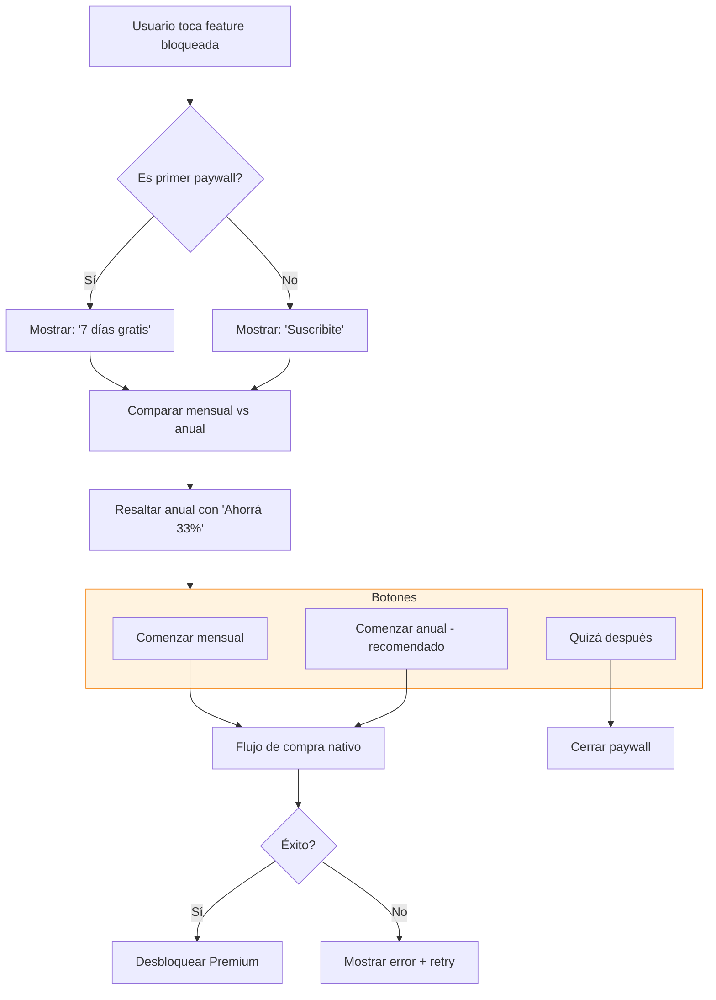
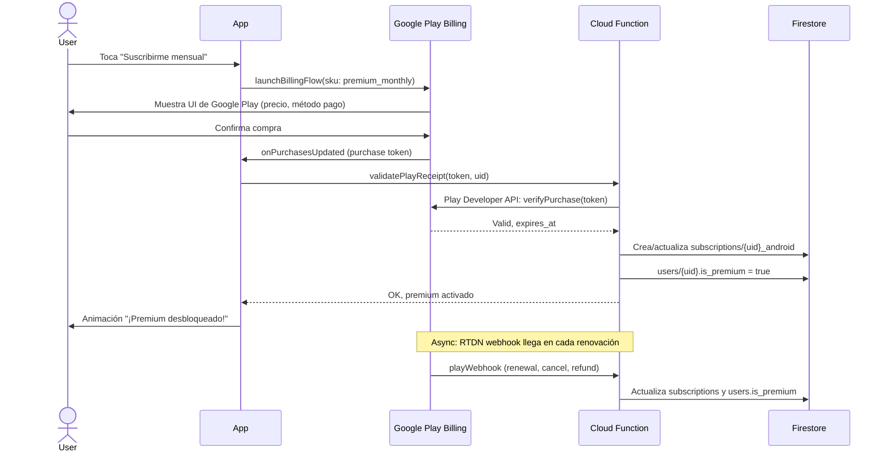

# 08 — Modelo de monetización

> Cómo StoryEnglish Kids gana dinero. Modelo freemium con suscripción mensual y anual, integración con billing nativo de Google Play y App Store.

---

## 1. Resumen del modelo

**Freemium**: la app es gratis con funciones limitadas, y se cobra una suscripción para desbloquear todo el contenido y features premium.

| Plan | Precio | Características |
|------|--------|-----------------|
| **Free** | $0 | 3 cuentos/mes, audio en inglés, sin descarga offline, 1 perfil de niño, progreso local |
| **Premium mensual** | $4.99/mes | Todo ilimitado + audio ES + offline + hasta 4 perfiles + panel padres completo |
| **Premium anual** | $39.99/año (= $3.33/mes, 33% ahorro) | Igual que mensual |

**Trial gratuito**: 7 días de Premium al crear cuenta, sin cobro. Cancelable en cualquier momento antes del día 7.

---

## 2. Por qué freemium y no pago upfront

- **Adquisición**: los padres son reacios a pagar por apps infantiles sin probar. Freemium elimina la fricción.
- **Demostración de valor**: el niño se engancha con los 3 cuentos gratis, el padre ve el valor y convierte.
- **Recomendación orgánica**: padres comparten "bájate esta app, es gratis" → crecimiento orgánico.
- **Cumplimiento stores**: Google Play y Apple prefieren suscripciones para apps con contenido digital recurrente.

---

## 3. Features por plan

### Free

- ✅ Acceso a **3 cuentos por mes** (rotación curada por el equipo)
- ✅ Audio narrado en **inglés** (TTS Neural2)
- ✅ Lectura guiada con resaltado sincronizado
- ✅ Vocabulario destacado (tocar palabra → traducción)
- ✅ 1 perfil de niño
- ✅ Progreso básico (cuentos leídos)
- ✅ 5 logros desbloqueables

### Premium

- ✅ **Acceso completo** a catálogo entero (200+ cuentos)
- ✅ Audio narrado en **inglés Y español**
- ✅ **Descarga offline** de cuentos (hasta 50)
- ✅ Hasta **4 perfiles de niño** por cuenta
- ✅ **Panel padres avanzado** (reportes, tiempo por categoría, predicciones)
- ✅ **Preguntas de comprensión** después de cada cuento
- ✅ Catálogo completo de logros (30+)
- ✅ Soporte prioritario por email
- ✅ Nuevos cuentos cada semana (los free los tienen 1 mes después)
- ✅ Modo "noche" y temas personalizados

### Lo que NO se cobra (siempre gratis)

- Auth y verificación parental
- Onboarding y configuración inicial
- Acceso a soporte básico (FAQ)
- Cumplimiento COPPA/GDPR-K (exportar y borrar datos)

---

## 4. Precios por región

Los precios en stores se ajustan automáticamente por región (purchasing power parity). Sugerencias:

| Región | Mensual | Anual |
|--------|---------|-------|
| EE.UU. | $4.99 | $39.99 |
| Canadá | CAD $5.99 | CAD $49.99 |
| UE (Euro) | €4.99 | €39.99 |
| Reino Unido | £3.99 | £29.99 |
| México | MXN $79 | MXN $599 |
| Argentina | ARS $499 | ARS $3.999 |
| Brasil | BRL $14.90 | BRL $99.90 |
| Resto Latam | USD $2.99 | USD $19.99 |

> Nota: los precios en Argentina pueden requerir ajuste por inflación. Revisar trimestralmente.

---

## 5. Lógica de paywall

### Cuándo se muestra el paywall

| Trigger | Comportamiento |
|---------|----------------|
| Usuario free intenta abrir cuento #4 del mes | Paywall |
| Usuario free intenta descargar offline | Paywall |
| Usuario free intenta activar audio en español | Paywall |
| Usuario free intenta crear 2do perfil de niño | Paywall |
| Usuario free intenta abrir pregunta de comprensión | Paywall |
| Fin del trial gratuito | Paywall (no bloqueante: usuario pasa a Free) |
| Padre entra a "Gestionar suscripción" → si free, muestra planes | No es paywall, es upsell |

### Tipos de paywall

1. **Hard paywall**: bloquea la acción. Usuario debe elegir: suscribirse o cancelar.
2. **Soft paywall**: muestra beneficios Premium + botón "Quizá después". Usuario puede cerrar y seguir usando free.

**Recomendación MVP**: hard paywall para features bloqueadas, soft paywall en momentos no-bloqueantes (ej: fin de cuento, "Desbloquea más cuentos como este").

### Diseño del paywall

---

## 6. Integración con billing nativo

### 6.1 Google Play Billing

**Setup**:
- Productos en Google Play Console:
  - `premium_monthly` ($4.99/mes, auto-renewable)
  - `premium_annual` ($39.99/año, auto-renewable)
- Subscription status updates via **Play Developer API** + **RTDN (Real-time Developer Notifications)** webhook.

**Flujo de compra**:

### 6.2 App Store Billing

**Setup**:
- Productos en App Store Connect:
  - `premium_monthly` ($4.99/mes, auto-renewable)
  - `premium_annual` ($39.99/año, auto-renewable)
- Subscription status updates via **App Store Server API** + **Server Notifications V2**.

**Flujo**: idéntico a Google Play pero con StoreKit 2 en el cliente y endpoints de Apple server-side.

### 6.3 Manejo de estados de suscripción

| Estado | Significado | Acción |
|--------|-------------|--------|
| `active` | Suscripción vigente, premium on | `is_premium = true` |
| `grace_period` | Pago falló, en período de gracia (16 días Apple, 30 días Google) | `is_premium = true` (sigue activo) |
| `expired` | Suscripción expiró sin renovar | `is_premium = false` |
| `canceled` | Usuario canceló pero sigue vigente hasta expires_at | `is_premium = true` hasta expires_at |
| `refunded` | Reembolso concedido | `is_premium = false` inmediato |

---

## 7. Trial gratuito

- **Duración**: 7 días desde el primer inicio del trial.
- **Requisito**: tarjeta guardada en la store (Apple/Google lo manejan).
- **Cancelación**: el usuario puede cancelar antes del día 7 sin cargo.
- **No cobrable**: si cancela en día 7, se cobra el primer mes/año. Si cancela en día 6, no se cobra y Premium se desactiva al final del día 7.
- **Limitación**: 1 trial por cuenta. Segundos trials se bloquean checkeando `subscriptions` collection.

---

## 8. Restore purchases

Obligatorio por políticas de stores. Botón "Restaurar compras" en:
- Pantalla de paywall
- Pantalla de gestión de suscripción
- Login (al entrar, restaurar automáticamente)

Flujo:
1. App llama a `in_app_purchase.restorePurchases()`.
2. Store devuelve purchases pasadas del usuario en ese dispositivo/cuenta de store.
3. App envía receipts a Cloud Function de validación.
4. Cloud Function crea/actualiza `subscriptions` y `users.is_premium`.

---

## 9. Estrategia de conversión

### 9.1 Métricas objetivo

| Métrica | Target MVP |
|---------|------------|
| Free → Trial | 15-20% (de los que completan onboarding) |
| Trial → Paid | 40-50% |
| Free → Paid (sin trial) | 3-5% |
| Conversión total (free → paid) | 8-12% |
| Churn mensual | <8% |
| LTV / CAC | >3 |

### 9.2 Tácticas de conversión

1. **Trial de 7 días sin fricción**: botón grande "Empezar 7 días gratis" en paywall.
2. **Anual destacado**: ahorrar 33% vs mensual, badge "Más popular".
3. **Urgencia soft**: "Últimos 2 cuentos gratis de este mes" en Home del usuario free.
4. **Descuentos estacionales**: Black Friday, back-to-school, día del niño (Latam).
5. **Win-back**: email a usuarios cancelados a los 30 días con 50% off primer mes.

### 9.3 A/B testing de paywall

Tests a correr en Fase 4:
- Variante A: "7 días gratis" vs "Primer mes 50% off"
- Variante A: Precio mensual destacado vs anual destacado
- Variante A: Hard paywall vs Soft paywall (con beneficios)
- Variante A: Copy emocional ("Tu hijo merece más cuentos") vs racional ("Acceso a 200+ cuentos")

Medir: conversión a trial, conversión trial→paid, ARPU.

---

## 10. Política de reembolsos

- **Apple**: maneja automáticamente. Apps no deciden.
- **Google**: usuario solicita en Play Store. Si <48h y no usado, automático. Si >48h, caso por caso.
- **Nuestra política**: para casos excepcionales (problema técnico, error de compra), usuario contacta soporte y se procesa manualmente vía Play Console / App Store Connect.

---

## 11. Impuestos

- Apple y Google retienen y pagan impuestos (IVA, GST, etc.) en la mayoría de jurisdicciones. El desarrollador recibe el neto.
- En algunas jurisdicciones (Brasil, India) el desarrollador debe registrarse y pagar impuestos directamente. **Consultar con contador** antes del launch.

---

## 12. Monetización futura (no MVP)

Ideas para Fase 5+:

1. **Cuentos premium exclusivos**: paquetes temáticos pagos (ej: "Pack Navidad", "Pack Dinosaurios") con cuento nuevo mensual.
2. **Personalización del avatar**: skins, accesorios (compras únicas).
3. **Modo familiar**: plan multi-familia (hasta 8 perfiles) a $7.99/mes.
4. **B2B**: licencias para escuelas y bibliotecas.
5. **Libros físicos**: partnership con editoriales para vender libros físicos relacionados.

---

## 13. Compliance de billing

- **Apple App Store Review Guidelines 3.1.2**: suscripciones auto-renovables. Cumplimos.
- **Google Play Billing Policy**: todas las compras digitales dentro de la app deben usar Google Play Billing. Cumplimos.
- **No se permiten** pagos externos (Stripe, PayPal) dentro de la app para contenido digital.
- **Comunicación clara de precios** antes del botón de compra (requisito legal en UE y California).

---

## 14. Precio dinámico con Remote Config

En Fase 4, podemos usar Firebase Remote Config para:
- Ajustar precios por región sin update de la app.
- Hacer promociones temporales (Black Friday, Día del Niño).
- A/B testear precios (con cautela: usuarios sensibles a cambios de precio).

**Cuidado**: cambios de precio para suscripciones existentes requieren consentimiento del usuario. Aplicar solo a nuevas suscripciones.
