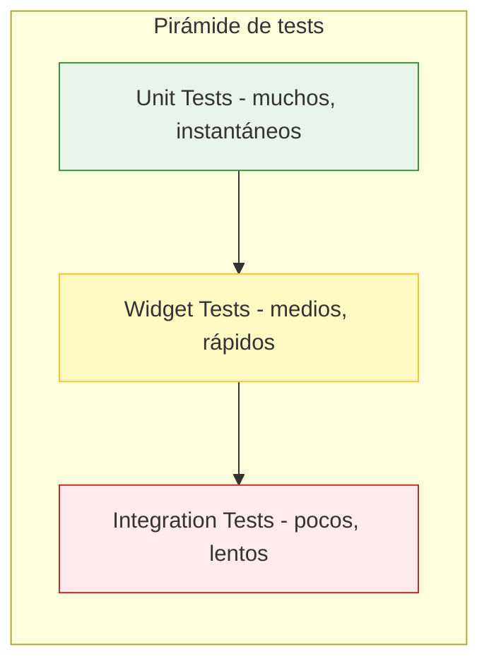

# 09 — Estrategia de testing

> Cómo garantizamos que StoryEnglish Kids funciona correctamente. Pirámide de tests, herramientas, CI/CD, y cobertura por capa.

---

## 1. Filosofía de testing

**Pirámide de tests clásica** adaptada a Flutter:



| Tipo | Cantidad | Velocidad | Qué valida |
|------|----------|-----------|------------|
| **Unit** | Muchos | <100ms c/u | Lógica de controllers, repos, models, utils |
| **Widget** | Medios | 200-500ms c/u | UI de pantallas, interacciones, estados |
| **Integration** | Pocos | 5-30s c/u | Flujos completos: onboarding, leer cuento, suscribirse |

**Cobertura objetivo**:
- Capa dominio (models, repositories interfaces): 90%+
- Capa datos (implementaciones, datasources): 80%+
- Capa presentación (controllers): 80%+
- Widgets: 60%+ (pantallas principales)
- Integration: 100% de los flujos críticos (no 100% del código, sino 100% de los user journeys clave)

---

## 2. Herramientas

| Herramienta | Uso |
|-------------|-----|
| `flutter_test` | Unit + widget tests (built-in) |
| `mocktail` | Mocks para tests unitarios |
| `integration_test` | Integration tests con device real/emulador |
| `firebase_auth_mocks` | Mock de Firebase Auth |
| `fake_cloud_firestore` | Firestore en memoria |
| `firebase_storage_mocks` | Mock de Storage |
| `patrol** | (opcional) Integration tests más rápidos |
| **Firebase Emulator Suite** | Backend local para integration tests |
| **GitHub Actions** | CI/CD |

---

## 3. Tests unitarios

### 3.1 Controllers

Los controllers (StateNotifiers de Riverpod) son el corazón de la lógica de presentación. Cada controller tiene su test file.

**Ejemplo** (`auth_controller_test.dart`):

```dart
import 'package:flutter_test/flutter_test.dart';
import 'package:mocktail/mocktail.dart';

class MockAuthRepository extends Mock implements AuthRepository {}

void main() {
  late MockAuthRepository repo;
  late AuthController controller;

  setUp(() {
    repo = MockAuthRepository();
    controller = AuthController(authRepository: repo);
  });

  group('loginWithEmail', () {
    test('emits loading then data when login succeeds', () async {
      // Arrange
      final user = AppUser(uid: 'uid', email: 'a@b.com', ...);
      when(() => repo.signInWithEmail(any(), any()))
          .thenAnswer((_) async => user);

      // Act
      const states = <AsyncValue<AppUser?>>[];
      controller.addListener((state) => states.add(state));

      await controller.loginWithEmail('a@b.com', 'pass');

      // Assert
      expect(states, [
        AsyncValue.loading(),
        AsyncValue.data(user),
      ]);
      verify(() => repo.signInWithEmail('a@b.com', 'pass')).called(1);
    });

    test('emits loading then error when login fails', () async {
      when(() => repo.signInWithEmail(any(), any()))
          .thenThrow(AuthFailure('Invalid credentials'));

      // ...
    });
  });
}
```

### 3.2 Repositories

Los repos se testean contra `fake_cloud_firestore` y `firebase_auth_mocks`:

```dart
import 'package:fake_cloud_firestore/fake_cloud_firestore.dart';
import 'package:flutter_test/flutter_test.dart';

void main() {
  late FakeFirebaseFirestore firestore;
  late StoryRepositoryImpl repo;

  setUp(() {
    firestore = FakeFirebaseFirestore();
    repo = StoryRepositoryImpl(firestore: firestore);
  });

  group('getPublishedStories', () {
    test('returns only published stories', () async {
      await firestore.collection('stories').doc('s1').set({
        'title': 'Published',
        'published': true,
        ...
      });
      await firestore.collection('stories').doc('s2').set({
        'title': 'Draft',
        'published': false,
        ...
      });

      final stories = await repo.getPublishedStories();

      expect(stories.length, 1);
      expect(stories.first.id, 's1');
    });
  });
});
```

### 3.3 Models y serialización

Cada modelo con freezed tiene su test de `fromJson` / `toJson`:

```dart
test('serializes correctly', () {
  final story = Story(...);
  final json = story.toJson();
  final restored = Story.fromJson(json);
  expect(restored, story);
});
```

### 3.4 Cobertura objetivo por capa

| Componente | Cobertura |
|------------|-----------|
| `core/utils/` | 95% |
| `core/validators` | 100% |
| `features/*/domain/` | 90% |
| `features/*/data/` | 80% |
| `features/*/presentation/controllers/` | 80% |
| `features/*/presentation/widgets/` | 60% (golden tests) |

---

## 4. Tests de widget

### 4.1 Pantallas

Cada pantalla tiene un test file que valida:
- Renderiza correctamente en estado loading / data / error / empty
- Interacciones (tap, scroll, form submit)
- Navegación entre pantallas

```dart
testWidgets('LoginScreen shows error on invalid email', (tester) async {
  await tester.pumpWidget(
    MaterialApp(home: LoginScreen()),
  );

  await tester.enterText(find.byKey(Key('emailField')), 'not-an-email');
  await tester.tap(find.byKey(Key('submitBtn')));
  await tester.pump();

  expect(find.text('Email inválido'), findsOneWidget);
});
```

### 4.2 Golden tests

Para widgets visuales importantes (cards, badges, popups), golden tests comparan screenshots:

```dart
testGoldens('StoryCard renders correctly', (tester) async {
  await tester.pumpWidgetBuilder(
    StoryCard(story: mockStory),
    wrapper: materialAppWrapper(theme: appTheme),
  );

  await screenMatchesGolden(tester, 'story_card_default');
});
```

---

## 5. Tests de integración

### 5.1 Setup

Usamos **Firebase Emulator Suite** corriendo en CI para integration tests:

```yaml
# .github/workflows/ci.yml
- name: Start Firebase Emulator
  run: |
    cd firebase
    firebase emulators:start --only auth,firestore,storage,functions &
    sleep 10  # Wait for emulator to be ready
```

### 5.2 Flujos críticos a testear

| Flujo | Descripción | Tests |
|-------|-------------|-------|
| **Onboarding** | Signup → verificación → perfil niño → home | 1 test E2E |
| **Leer cuento** | Home → library → story detail → reader → end | 1 test E2E |
| **Reanudar lectura** | Leer mitad → cerrar → reabrir → sigue donde quedó | 1 test |
| **Logro desbloqueado** | Leer 1er cuento → logro "First Steps" se desbloquea | 1 test |
| **Paywall** | Usuario free intenta abrir cuento #4 → paywall | 1 test |
| **Compra (sandbox)** | Trial → compra mensual → premium activado | 1 test (en sandbox) |
| **Restaurar compra** | Reinstalar app → restore → premium vuelve | 1 test |
| **Eliminar cuenta** | Padre elimina cuenta → todos los datos se borran | 1 test |

### 5.3 Ejemplo de integration test

```dart
// integration_test/onboarding_test.dart
import 'package:integration_test/integration_test.dart';
import 'package:flutter_test/flutter_test.dart';
import 'package:storyenglish_kids/main_dev.dart' as app;

void main() {
  IntegrationTestWidgetsFlutterBinding.ensureInitialized();

  testWidgets('user can complete onboarding', (tester) async {
    app.main();
    await tester.pumpAndSettle();

    // Signup
    await tester.tap(find.byKey(Key('signupBtn')));
    await tester.pumpAndSettle();

    await tester.enterText(find.byKey(Key('emailField')), 'test@test.com');
    await tester.enterText(find.byKey(Key('passwordField')), 'Password123!');
    await tester.tap(find.byKey(Key('submitBtn')));
    await tester.pumpAndSettle();

    // Parental verification (math challenge)
    await tester.tap(find.byKey(Key('verifyBtn')));
    await tester.pumpAndSettle();

    // Answer math questions
    expect(find.text('Cuánto es 5 + 7?'), findsOneWidget);
    await tester.enterText(find.byKey(Key('answerField')), '12');
    await tester.tap(find.byKey(Key('submitBtn')));
    await tester.pumpAndSettle();
    // ... 2 more questions

    // Pick avatar
    await tester.tap(find.byKey(Key('avatar_1')));
    await tester.tap(find.byKey(Key('nextBtn')));
    await tester.pumpAndSettle();

    // Pick age
    await tester.tap(find.byKey(Key('age_4')));
    await tester.tap(find.byKey(Key('nextBtn')));
    await tester.pumpAndSettle();

    // Pick interests
    await tester.tap(find.byKey(Key('interest_animals')));
    await tester.tap(find.byKey(Key('interest_adventure')));
    await tester.tap(find.byKey(Key('finishBtn')));
    await tester.pumpAndSettle();

    // Verify in home
    expect(find.byKey(Key('homeScreen')), findsOneWidget);
  });
}
```

---

## 6. Testing de reglas de Firestore

Las reglas de seguridad son críticas. Las testeamos con `@firebase/rules-unit-testing`:

```typescript
// firebase/functions/test/firestore.rules.test.ts
import { assertFails, assertSucceeds, initializeTestEnvironment } from '@firebase/rules-unit-testing';

let env: any;

beforeAll(async () => {
  env = await initializeTestEnvironment({ projectId: 'test' });
});

afterEach(async () => {
  await env.clearFirestore();
});

describe('users/{uid} rules', () => {
  test('owner can read own doc', async () => {
    const db = env.authenticatedContext('user123').firestore();
    await db.collection('users').doc('user123').set({ email: 'a@b.com' });
    await assertSucceeds(db.collection('users').doc('user123').get());
  });

  test('cannot read other user doc', async () => {
    const db = env.authenticatedContext('user123').firestore();
    await env.authenticatedContext('user456').firestore()
      .collection('users').doc('user456').set({ email: 'c@d.com' });
    await assertFails(db.collection('users').doc('user456').get());
  });

  test('cannot set is_premium from client', async () => {
    const db = env.authenticatedContext('user123').firestore();
    await db.collection('users').doc('user123').set({
      email: 'a@b.com',
      is_premium: false,
      parental_verified_at: null,
      created_at: new Date(),
      updated_at: new Date(),
      auth_provider: 'email',
    });
    await assertFails(db.collection('users').doc('user123').update({
      is_premium: true,
    }));
  });
});

describe('children_profiles rules', () => {
  test('non-verified parent cannot create child profile', async () => {
    const db = env.authenticatedContext('user123').firestore();
    await db.collection('users').doc('user123').set({
      email: 'a@b.com',
      parental_verified_at: null,
      // ... other required fields
    });
    await assertFails(db.collection('children_profiles').doc('c1').set({
      user_uid: 'user123',
      name: 'Test',
      age: 4,
    }));
  });
});
```

---

## 7. Testing de Cloud Functions

Cada Cloud Function tiene sus tests en `firebase/functions/test/`:

```typescript
// test/storyIngest.test.ts
import { describe, it, expect, beforeAll } from 'vitest';
import { storyIngest } from '../src/storyIngest';

describe('storyIngest', () => {
  it('generates vocabulary with Gemini', async () => {
    const result = await storyIngest({
      title: 'Little Red Riding Hood',
      textEn: 'Once upon a time...',
    });

    expect(result.vocabulary).toBeDefined();
    expect(result.vocabulary.length).toBeGreaterThan(3);
    expect(result.translation).toBeDefined();
    expect(result.questions.length).toBe(3);
  });
});
```

Mocks para Gemini y TTS:

```typescript
// test/mocks/geminiMock.ts
export const geminiMock = {
  generateContent: vi.fn().mockResolvedValue({
    response: { text: () => JSON.stringify({
      vocabulary: [...],
      translation: '...',
      questions: [...],
    })},
  }),
};
```

---

## 8. CI/CD

### 8.1 Workflow de CI (cada PR)

```yaml
# .github/workflows/ci.yml
name: CI
on:
  pull_request:
    branches: [main, develop]

jobs:
  analyze:
    runs-on: ubuntu-latest
    steps:
      - uses: actions/checkout@v4
      - uses: subosito/flutter-action@v2
        with:
          flutter-version: '3.24.0'
      - run: flutter pub get
      - run: flutter analyze
      - run: dart run dart_code_metrics:metrics lib --ruleset=strict

  unit-tests:
    runs-on: ubuntu-latest
    steps:
      - uses: actions/checkout@v4
      - uses: subosito/flutter-action@v2
      - run: flutter pub get
      - run: flutter test --coverage
      - name: Upload coverage
        uses: codecov/codecov-action@v4
        with:
          file: ./coverage/lcov.info

  firestore-rules-tests:
    runs-on: ubuntu-latest
    steps:
      - uses: actions/checkout@v4
      - uses: actions/setup-node@v4
        with:
          node-version: '20'
      - run: cd firebase/functions && npm ci
      - run: cd firebase/functions && npm test

  integration-tests:
    runs-on: macos-latest
    steps:
      - uses: actions/checkout@v4
      - uses: subosito/flutter-action@v2
      - name: Start Firebase Emulator
        run: |
          npm install -g firebase-tools
          cd firebase && firebase emulators:start --only auth,firestore,storage &
          sleep 15
      - run: flutter test integration_test
```

### 8.2 Workflow de CD (deploy a dev/prod)

```yaml
# .github/workflows/cd_dev.yml
name: Deploy Dev
on:
  push:
    branches: [develop]

jobs:
  deploy-functions:
    runs-on: ubuntu-latest
    steps:
      - uses: actions/checkout@v4
      - uses: actions/setup-node@v4
      - run: npm install -g firebase-tools
      - name: Deploy to Firebase Dev
        run: |
          cd firebase
          firebase deploy --only functions,firestore:rules,storage:rules
        env:
          FIREBASE_TOKEN: ${{ secrets.FIREBASE_TOKEN_DEV }}
```

---

## 9. Cobertura mínima obligatoria

| Métrica | Mínimo | Target |
|---------|--------|--------|
| Cobertura total | 70% | 80% |
| Capa dominio | 85% | 95% |
| Capa datos | 70% | 85% |
| Capa presentación (controllers) | 75% | 85% |
| Reglas Firestore | 90% | 95% |
| Cloud Functions | 70% | 85% |

Si un PR baja la cobertura por debajo del mínimo, **CI falla** y no se mergea.

---

## 10. Testing manual

Para features visuales y UX (animaciones, audio), el testing automatizado es limitado. Hacemos QA manual:

### Antes de cada release:

1. **Smoke test** en 2 dispositivos físicos (Android + iOS).
2. **Beta privada**: 5-10 familias prueban 1 semana antes del release.
3. **Test con niño**: si es posible, probar con un niño real observando su interacción.

### Checklist QA pre-release:

- [ ] Onboarding completo funciona
- [ ] Login con email, Google y Apple
- [ ] Verificación parental bloquea correctamente
- [ ] Crear 4 perfiles de niño (límite funciona)
- [ ] Library carga y filtra
- [ ] Reader reproduce audio y resalta palabras
- [ ] Tocar palabra abre popup con traducción
- [ ] Pausa / resume / speed funcionan
- [ ] Reanudar lectura funciona
- [ ] Logros se desbloquean
- [ ] Panel padres con PIN
- [ ] Límite diario bloquea cuando corresponde
- [ ] Paywall se muestra correctamente
- [ ] Trial funciona
- [ ] Restore purchases funciona
- [ ] Eliminar cuenta borra todos los datos
- [ ] App funciona en offline (cuentos descargados)
- [ ] App funciona en tablet (orientación landscape)
- [ ] No crashes en Crashlytics

---

## 11. Testing de accesibilidad

Ver `10-accessibility.md` para el detalle. En CI corremos:

```yaml
- name: Accessibility tests
  run: flutter test test/accessibility_test.dart
```

Que valida:
- Contraste de colores (WCAG AA)
- Tamaño mínimo de tap targets (44x44 pt)
- Labels semánticos en todos los widgets interactivos
- Soporte para texto escalado hasta 200%
